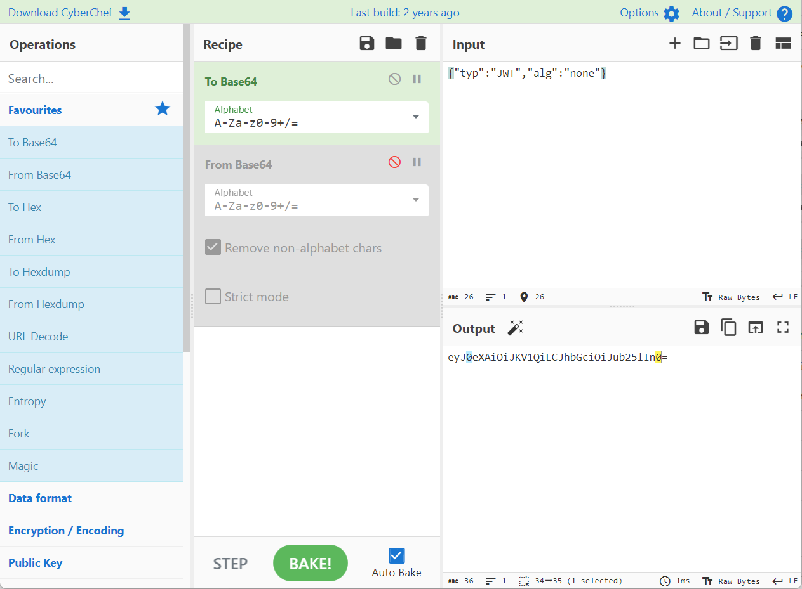
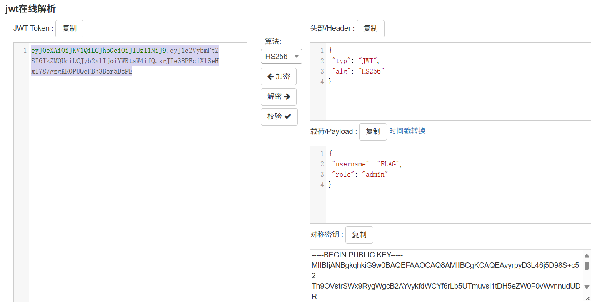

# JSON Web Token是什么

> JWT简称JSON Web Token，也就是通过JSON形式作为Web应用中的令牌，用于在各方之间安全地将信息作为JSON对象传输。在数据传输过程中还可以完成数据加密、签名等相关处理。

用处：**信息交换、安全验证**

# 组成

- 标头（Header）
- 有效载荷（Payload）
- 签名（Signature）
- 因此，JWT通常如下所示: Header.Payload.Signature

## Header

- 标头通常由两部分组成：令牌的类型（即JWT）和所使用的签名算法，例如HMAC、SHA256或RSA。它会使用 Base64编码组成 JWT 结构的第一部分

```json
{
    "alg":"HS256",
    "typ":"JWT"
}
```

## Payload

- 令牌的第二部分是有效负载，其中包含声明。同样的,它会使用Base64 编码组成 JWT 结构的第二部分，不会放敏感信息

```json
{
    "sub":"192475786",
    "name":"John",
    "admin":true
}
```

## Signature

- JWT 的 Signature 部分是通过对 Header（头部）和 Payload（负载）进行 Base64Url 编码后，再加上一个密钥（secret），使用 Header 中指定的签名算法（像 HMAC SHA256 或者 RSA）生成的。其生成公式为：

```
HMACSHA256(
  base64UrlEncode(header) + "." +
  base64UrlEncode(payload),
  secret)
```

- Signature 能确保 JWT 在传输过程中没有被篡改。当服务器收到 JWT 后，会用相同的算法和密钥重新计算签名。要是计算出来的签名和 JWT 中包含的 Signature 不一样，就表明令牌已被修改，服务器会拒绝该令牌。

# 题目(CTFhub)

## 无签名


随便输点登陆，有2次请求，一个post,一个get。

登陆时返回了一个token


登陆成功后，再发送了个get进入页面，请求中加了上面得到的token，显示只有admin才能拿到flag


base64解码token


将算法改为none,guset改为admin




用.拼接在一起，去掉签名

```
eyJ0eXAiOiJKV1QiLCJhbGciOiJub25lIn0=.eyJ1c2VybmFtZSI6IjEiLCJwYXNzd29yZCI6IjEiLCJyb2xlIjoiYWRtaW4ifQ==.
```

重发得到flag

## 弱密钥


前面和上题一样，拿到token后，jwt解码


当开始我用的字典跑，跑了好几个字典就是跑不出来，最后还是暴力破解

秘钥： ekfw 


换成admin


改token，重放得到flag


## 修改签名算法


```php
<!DOCTYPE html>
<html>
    <head>
        <meta charset="utf-8" />
        <meta name="viewport" content="width=device-width, initial-scale=1, shrink-to-fit=no" />
        <title>CTFHub JWTDemo</title>
        <link rel="stylesheet" href="/static/style.css" />
    </head>
    <body>
        <main id="content">
            <header>Web Login</header>
            <form id="login-form" method="POST">
                <input type="text" name="username" placeholder="Username" />
                <input type="password" name="password" placeholder="Password" />
                <input type="submit" name="action" value="Login" />
            </form>
            <a href="/publickey.pem">publickey.pem</a>
        </main>
        <?php echo $_COOKIE['token'];?>
        <hr/>
    </body>
</html>

    
<?php
require __DIR__ . '/vendor/autoload.php';
use \Firebase\JWT\JWT;

class JWTHelper {
  public static function encode($payload=array(), $key='', $alg='HS256') {
    return JWT::encode($payload, $key, $alg);
  }
  public static function decode($token, $key, $alg='HS256') {
    try{
            $header = JWTHelper::getHeader($token);
            $algs = array_merge(array($header->alg, $alg));
      return JWT::decode($token, $key, $algs);
    } catch(Exception $e){
      return false;
    }
    }
    public static function getHeader($jwt) {
        $tks = explode('.', $jwt);
        list($headb64, $bodyb64, $cryptob64) = $tks;
        $header = JWT::jsonDecode(JWT::urlsafeB64Decode($headb64));
        return $header;
    }
}

$FLAG = getenv("FLAG");
$PRIVATE_KEY = file_get_contents("/privatekey.pem");
$PUBLIC_KEY = file_get_contents("./publickey.pem");

if ($_SERVER['REQUEST_METHOD'] === 'POST') {
    if (!empty($_POST['username']) && !empty($_POST['password'])) {
        $token = "";
        if($_POST['username'] === 'admin' && $_POST['password'] === $FLAG){
            $jwt_payload = array(
                'username' => $_POST['username'],
                'role'=> 'admin',
            );
            $token = JWTHelper::encode($jwt_payload, $PRIVATE_KEY, 'RS256');
        } else {
            $jwt_payload = array(
                'username' => $_POST['username'],
                'role'=> 'guest',
            );
            $token = JWTHelper::encode($jwt_payload, $PRIVATE_KEY, 'RS256');
        }
        @setcookie("token", $token, time()+1800);
        header("Location: /index.php");
        exit();
    } else {
        @setcookie("token", "");
        header("Location: /index.php");
        exit();
    }
} else {
    if(!empty($_COOKIE['token']) && JWTHelper::decode($_COOKIE['token'], $PUBLIC_KEY) != false) {
        $obj = JWTHelper::decode($_COOKIE['token'], $PUBLIC_KEY);
        if ($obj->role === 'admin') {
            echo $FLAG;
        }
    } else {
        show_source(__FILE__);
    }
}
?>
```

jwt用的 RS256算法，并且提供了公钥

根据源码，服务器默认使用 RS256 验证签名，但允许客户端通过 JWT 头部 (`alg`) 强制使用其他算法。可以将`alg`改为`HS256`，并使用公开的 RSA 公钥作为 HMAC 密钥伪造签名。

登陆后jwt显示出来了


jwt解码


算法改为HS256，权限改为admin，将公钥作为秘钥进行编码



重放修改token,得到flag


# 题目（bugku）


登陆时，给了一个JWT,一个session


jwt解码


秘钥爆破，得到秘钥是NuAa，再改用户为admin,编码


修改jwt后再重放


