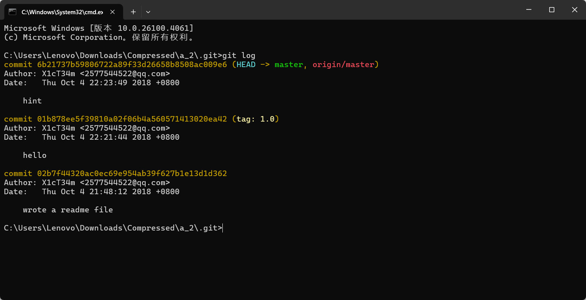

## 闪的好快


打开后是一个不断变换的git动图，高度好像也缺了


对git图片进行分解


写个脚本，对二维码进行逐帧扫描，最后合并

```python
import imageio
from PIL import Image
from pyzbar.pyzbar import decode

def extract_qr_data_from_gif(gif_path):
    gif = imageio.get_reader(gif_path)
    qr_data_list = []

    for frame in gif:
        pil_image = Image.fromarray(frame)

        decoded_objects = decode(pil_image)
        for obj in decoded_objects:
            qr_data_list.append(obj.data.decode('utf-8'))
    
    unique_qr_data = list(qr_data_list)
    combined_data = ''.join(unique_qr_data)
    
    return combined_data

gif_file_path = 'masterGO.gif'
combined_qr_data = extract_qr_data_from_gif(gif_file_path)
print(combined_qr_data)
```


## come_game


一个游戏


玩一小会后发现多了几个文件


发现每通过一关后save1都会更改


第一关卡为31，第二关为32，不断进行更改，当为35时，游戏到达第5关，出现了flag


## 神秘的文件


压缩包里嵌压缩包，且第二个压缩包需要密码，明文攻击


得到密码q1w2e3r4

docx文件打不开，放入010发现开头是504b0304，后缀改为zip打开


在里面找到了flag.txt，ZmxhZ3tkMGNYXzFzX3ppUF9maWxlfQ==

base64解码得flag,flag{d0cX_1s_ziP_file}

## 全球最大交友网站


下载a.zip，git log查看历史版本



```reset --hard 6b21737b59806722a89f33d26658b8508ac009e6```回滚


## nextGen 1


翻译：这只是我们想要开发的用于监控公司各部门的控制面板的第一个版本

试试直接访问```http://49.232.142.230:11835/flag.txt```


查看主页的源码，发现main.js

```js
function myFunc(eventObj) {
    var xhttp = new XMLHttpRequest();
    xhttp.onreadystatechange = function () {
      if (this.readyState == 4 && this.status == 200) {
        document.getElementById("content").innerHTML = xhttp.responseText;
      }
    };
    xhttp.open("POST", '/request');
    xhttp.setRequestHeader("Content-Type", "application/x-www-form-urlencoded");
    xhttp.send("service=" + this.attributes.link.value);

  }

  var dep = document.getElementsByClassName('department');
  for (var i = 0; i < dep.length; i++) {
    dep[i].addEventListener('click', myFunc);
  }
```

1. **事件监听**：代码首先选择所有 class 为`department`的元素，并为每个元素添加了点击事件监听器`myFunc`。
2. **异步请求**：当点击任意`.department`元素时，`myFunc`函数会被调用，创建一个 XMLHttpRequest 对象并发送 POST 请求到`/request`路径。
3. **数据处理**：请求的参数是从被点击元素的`link`属性获取的，格式为`service=属性值`。
4. **响应处理**：当请求成功返回（状态码 200 且请求完成）时，将响应内容更新到 id 为`content`的 DOM 元素中。


看一下overview


请求的是外链,可能有ssrf，file://试试


