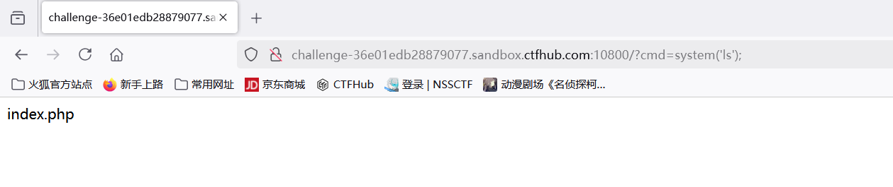
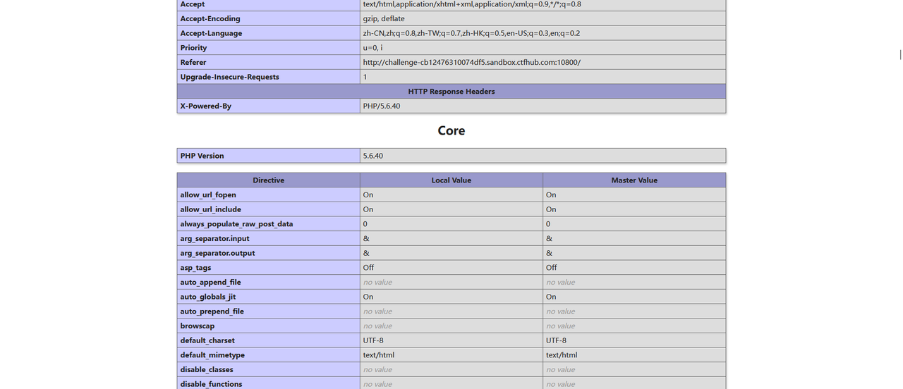
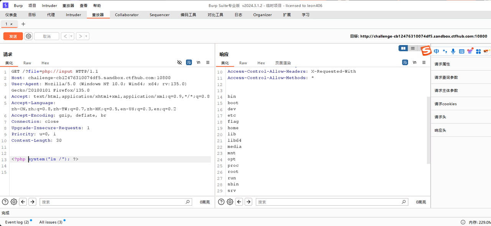
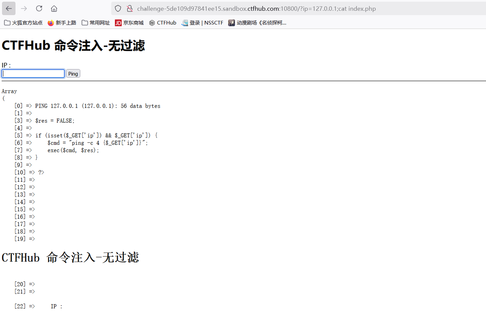

# RCE

RCE是什么？

> **RCE**，即**远程代码执行**，是一种严重的安全漏洞。它允许攻击者在目标服务器上远程执行任意代码或操作系统命令，从而可能完全控制受影响的系统。

## eval执行

### 知识

eval函数的语法

```php
eval(string $code): mixed;
```

`$code` 是一个字符串，且必须是有效的 PHP 代码，必须以分号 `;` 结尾，除非代码是一个代码块。

### 题目


### 解题

查看当前目录



没有看到flag，查看上一级的目录


发现当中有个falg\_16134，进去


## 文件包含

### 题目


### 解题

点开shell,是个一句话木马


题目不让输入flag，也提示了href="shell.txt"，那么?file=shell.txt


接着用hcakbar


## php://input

### 知识

> `phpinfo()` 函数用于输出关于 PHP 配置的大量信息。这些信息涵盖了 PHP 版本、编译选项、服务器环境、PHP 扩展、PHP 常量等众多方面。
>
> `php://` 是 PHP 提供的一种协议流包装器，它可以用于访问各种资源，例如标准输入输出、过滤器等。
>
> `php://input` 是 PHP 中的一个只读流，允许直接访问 HTTP 请求体中的原始数据。

### 题目


### 解题

伪协议，查看phpinfo,php://input是能用的

使用burp伪造，先看一下上级目录


发现有flag


进去，获得flag


## 读取源代码

### 知识

> php://filter/\[读|写|两者兼有的过滤器链]/resource=要处理的资源

### 题目


### 解题

告诉了我们flag的位置了，直接构造php://filter/resource=/flag，获取flag


## 远程包含

### 题目


### 解题

看一下phpinfo



发现allow\_url....都是on,php://input是能用的，使用burp抓包，重放，构造，看一下上级目录



发现flag，进去 ，获得flag


## 命令注入

### 题目


### 解题

题目中说了无过滤直接url中输入命令，用;隔开，先看一下目录


有2个文件，都进去看一下




最终在26433137587301.php的源代码中发现了flag


