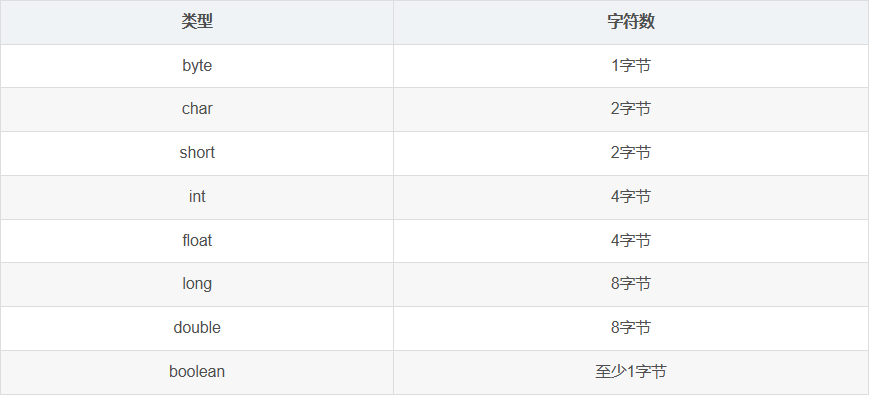
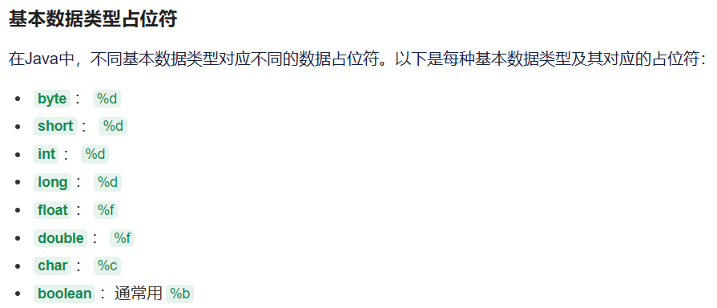

# 数据类型



java字符集是**Unicode**

**float**保留8位，末尾加F或f；默认**double**，16位有效数字

基本类型**从低到高**：byte short char int long float double

**%-30.12f  意思：左对齐，总共30位，小数12位**



# **Scanner方法**，读

引入包

```java
import java.util.Scanner;
```

创建对象

```java
Scanner reader=new Scanner(System.in);
```

开始读

```java
double x=reader.nextDouble();
```

## 数组

    float a[];
    
    float []a;

**分配元素空间**

数组名=new 数组元素的类型[数组元素的个数];

    boy=new float[4];

也可以一起

    float a[]=new float[4];

**length的使用**

length表示元素的个数

boy.length

a[2].length

## 逻辑类型

**boolean**        常量：true、false

## 整数类型

**int**    4字节

例如：int x=12,平均=12;    

**byte**    1字节

**short**    2字节

**long**    8字节

## 字符类型

**char** 2字节

char ch='的';

转义字符：\n

/root/certificate.crt

/root/private.key
