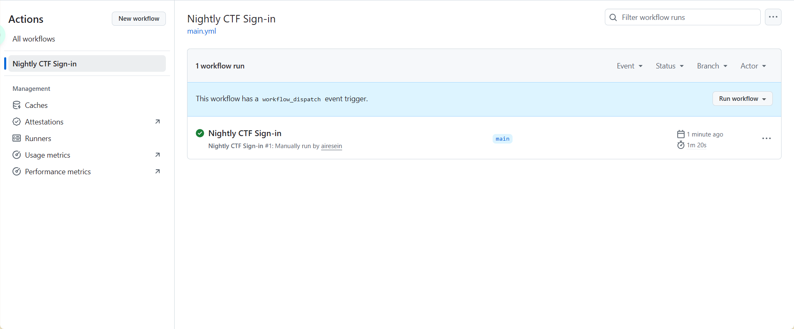

支持靶场：

- NSSCTF
- Bugku
- CTFHub
- 攻防世界
- 青少年CTF练习平台

# 食用
下载好之后，在**config.py**中配置账号和密码，该目录下```python main.py```启动脚本，log文件夹中查看签到日志。
# 本地自动化
前提是你每天都会用电脑，将CTFauto.vbs中的**位置**改为main.py的实际位置，将CTFauto.vbs放到启动目录下就可以了
```C:\Users\Lenovo\AppData\Roaming\Microsoft\Windows\Start Menu\Programs\Startup```
当然你也可以部署到服务器

[btn href="https://workdrive.zohopublic.com.cn/external/a2821ebe2d0ca25463b7855b519f0277bee28761cb6ed2c3b28a1c503377ea31/download" type="block larger blue " ico=""]下载(本地版本)[/btn]

# 进阶 使用github action自动签到

准备：一个github账号

支持靶场：

- Bugku
- CTFHub
- 攻防世界
- 青少年CTF练习平台

因为NSSCTF只能国内访问，所以签不了，代码进行了些修改，使用下面的下载

登陆github，创建新的私人仓库


将文件上传上去（上传前将账号密码在config.py中填好，没有就空）


点击**Action**


点击 **set up a workflow yourself**


将下载下来的文件中的.github/workflows/sign.yml中的内容复制过来，然后提交

> 这里配置的是每天晚上8点进行自动签到，配置时间的部分如下，不改就不动
>
> ```yml
> on:
>   schedule:
>     - cron: '0 12 * * *'        # UTC 12:00 = 北京时间 20:00
>   workflow_dispatch:
> 
> ```


点击Commmit changes


到这里就配置好了，自动签到能手动触发和每天晚上8点触发，先手动触发看一下是否正常

点击Action切换到下面页面，然后点击Nightly


点击**Run workflow**，然后刷新下界面，等待一段时间


亮起绿色代表成功。此脚本每天晚上8点都会自动运行进行签到，不用问了



日志在log\log.txt中查看


+++

原项目地址：https://github.com/YZBRH/CTFOnlinePlatform-CoinCollector