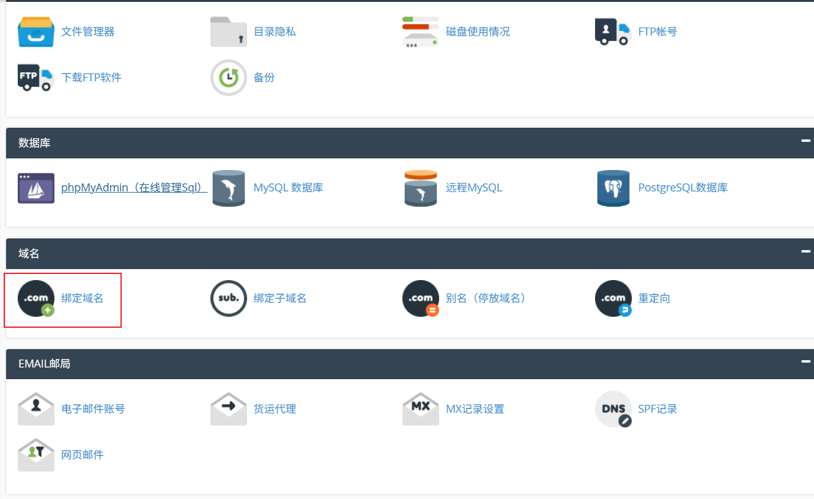
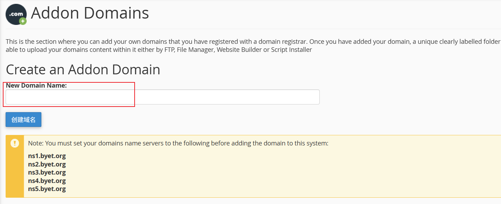
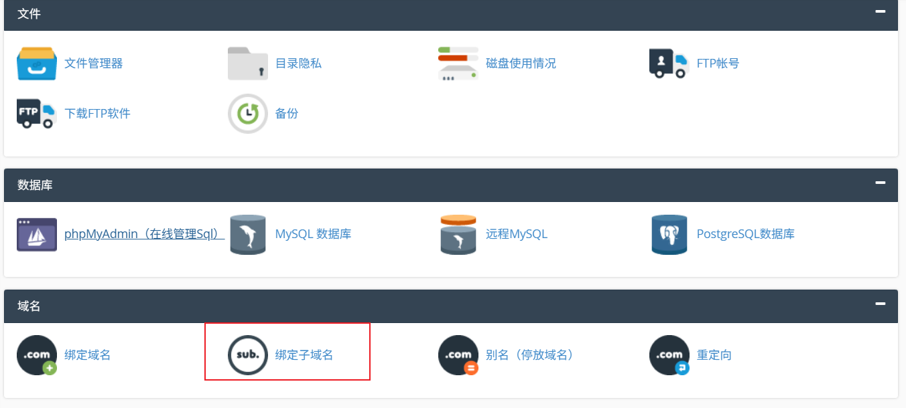
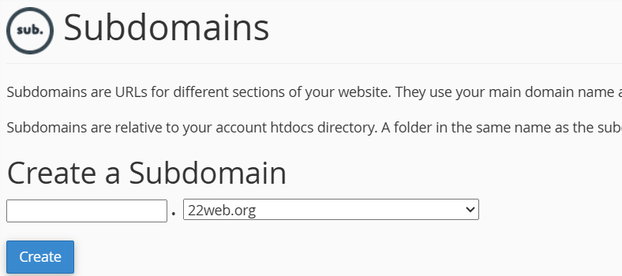
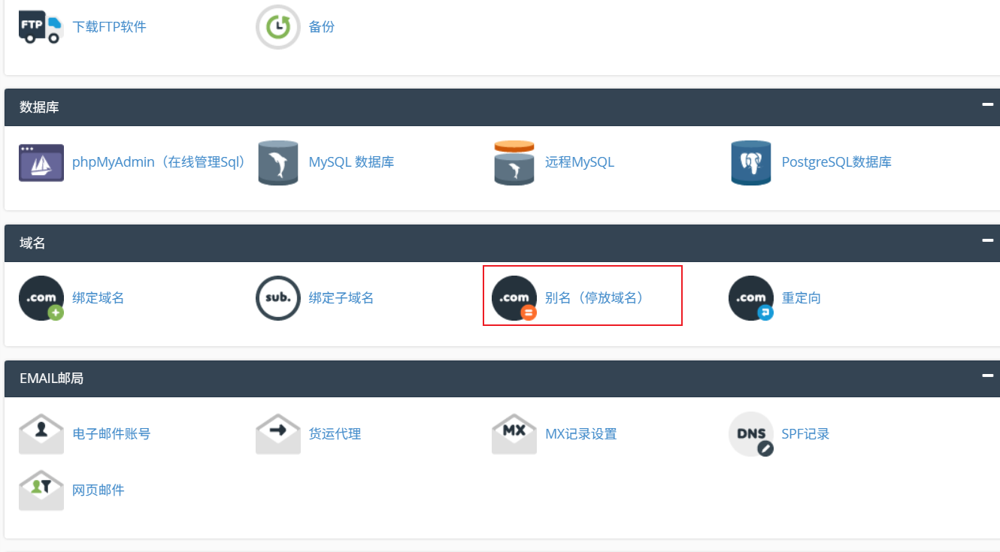
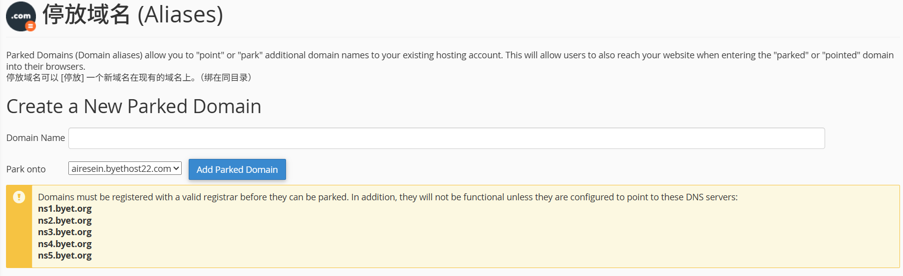

# 前言

有些托管网站使用的是**vistapanel**来给用户管理网站，如果使用自己的域名，它需要用户将域名的ns记录指向特定的DNS 服务器才能实现托管。但这样我们就不能更改该域名的解析了，最重要的是基于该域名的子域名也就失效了。想要网站使用自己的域名，能被托管，并且域名的解析不会失效，可以用下面的方法

# 实现方法

点击**域名**中的**绑定域名**



将自己域名的**ns**记录设置为它提供的那4个，等待一段时间（快的10分钟，慢的要等一天），点击**创建域名**（假设域名为**kei.top**）

```
ns1.byet.org
ns2.byet.org
ns3.byet.org
ns4.byet.org
ns5.byet.org
```



点击**域名**中的**绑定子域名**



创建一个子域名(假设为**hei.22web.org**)



点击**域名**中的**别名(停放域名)**



**Domain Name**填写自己的域名(**kei.top**)，**Park onto**选择刚才创建的子域名(**hei.22web.org**)



最后将自己的域名(**kei.top**)的ns换回去，加个cname解析指向子域名（**hei.22web.org**），这样就可以通过子域名（**hei.22web.org**）来管理的自己的域名（**kei.top**）

